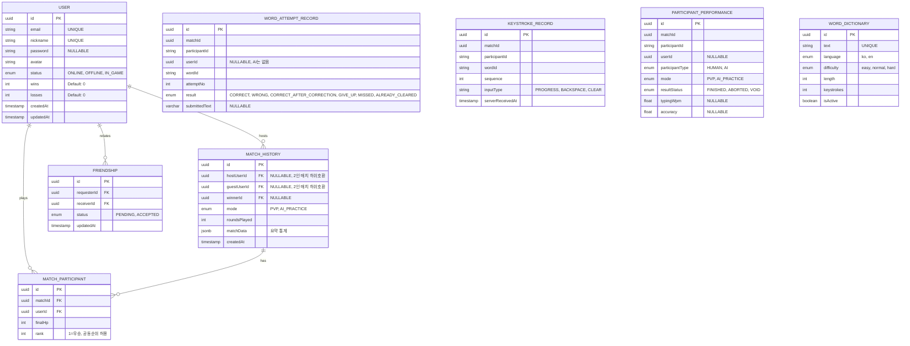

# Professional Database Modeling (PostgreSQL Optimized)

## 1. Advanced ER Diagram

## 2. Implementation Strategies

### 2.1. Concurrency Control
- **Optimistic Locking**: (미구현) 게임 결과 기록 시 `version` 필드를 활용해 데이터 충돌을 막는
  안. `MatchHistory`/`MatchParticipant`에 `@VersionColumn`은 없다 — 매치 종료는
  `AcidRainService`가 방 단위로 직렬화해서 처리하므로(§6.3 `word_submit` 레이스 처리) 현재는
  동시 쓰기 충돌 자체가 발생하지 않는 구조다.
- **Transactions**: 매치 종료 시 참가자 순위/전적 저장은 `saveMatchHistory()`에서 처리한다.

### 2.2. Storage Optimization
- **JSONB Usage**: `MatchHistory.matchData`가 `jsonb` 타입이다.
- **Partitioning**: `WordAttemptRecord`/`KeystrokeRecord`(§1)가 매치마다 다량의 행을 쌓는 원장
  테이블이라 파티셔닝 후보다 — 아직 적용되지 않았다.

## 3. Security
- **Data at Rest**: (미구현) 2FA는 현재 코드에 존재하지 않는다 — 실제 인증은 JWT 기반
  이메일/비밀번호와 OAuth뿐이다(`API_SPECIFICATION.md` 참고). 2FA를 도입하게 되면 시크릿은
  애플리케이션 레벨 암호화 후 저장을 권장.
- **GDPR Compliance**: 비식별화가 아니라 **완전 삭제**로 구현돼 있다 —
  `UserService.remove()`는 `userRepository.remove(user)`로 행 자체를 하드 삭제한다.
  `MatchParticipant.user`가 `ON DELETE CASCADE`라 탈퇴한 유저의 참가 기록(그 사람의 순위/HP
  행)만 함께 삭제된다 — 매치 자체나 다른 참가자의 기록은 남는다. `MatchHistory.hostUser`/
  `guestUser`(nullable 컬럼)도 `ON DELETE CASCADE`라, 탈퇴한 유저가 호스트/게스트로
  기록된 매치는 통째로 삭제된다는 차이가 있다.
