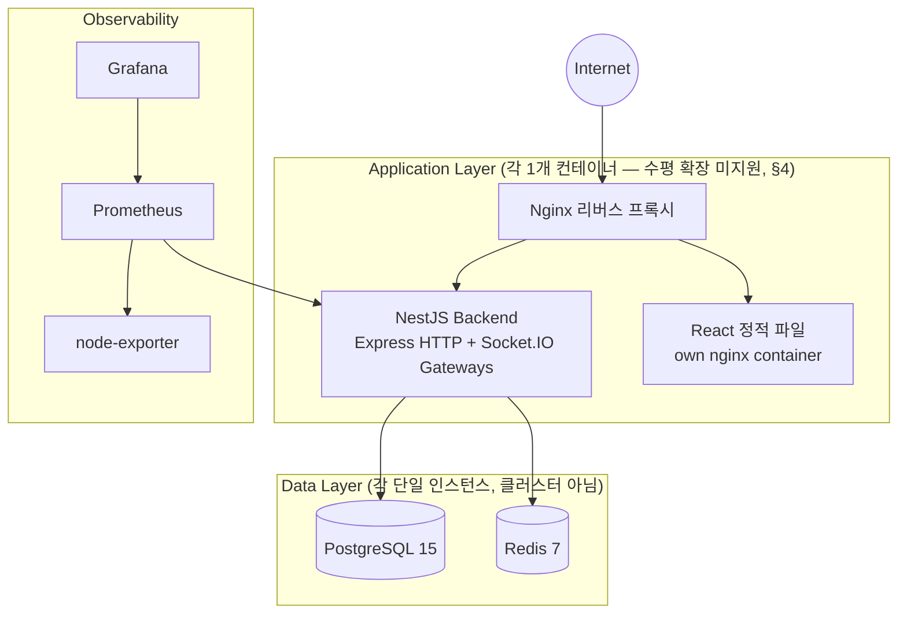
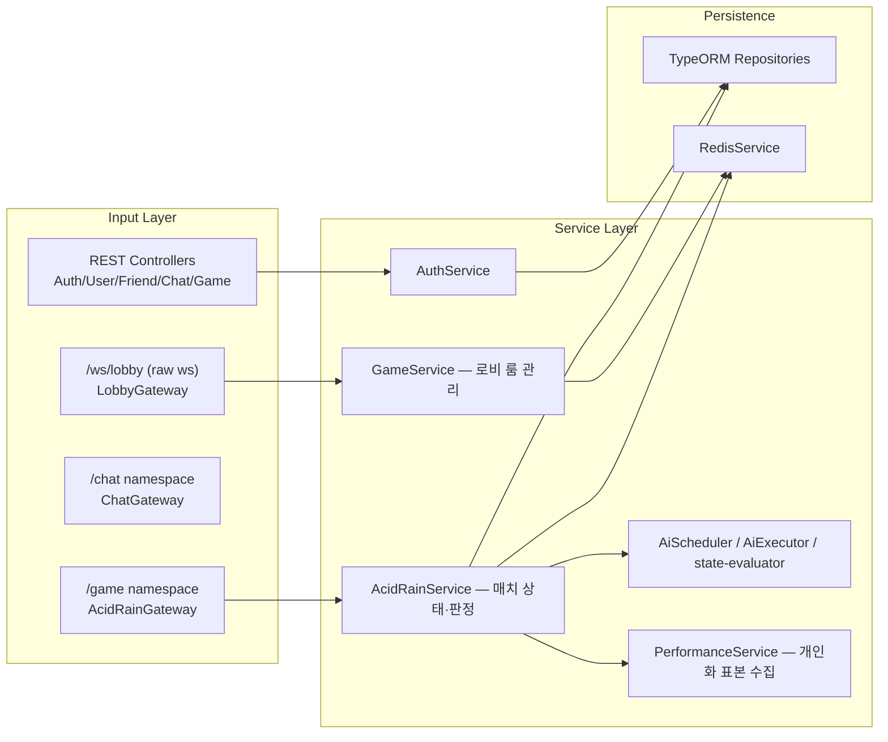

# System Architecture

## 1. Physical Topology (실제 `docker-compose.yml` 기준)



컨테이너 목록(`docker-compose.yml`): `db`(postgres:15-alpine), `redis`(redis:7-alpine),
`backend`(NestJS, `transcendence_backend/Dockerfile`), `frontend`(React 정적 빌드,
`transcendence_frontend/Dockerfile`), `nginx`(리버스 프록시), `prometheus`, `node-exporter`,
`grafana`. **모든 서비스가 정확히 1개 컨테이너**로 떠 있다 — 로드밸런서 뒤에 백엔드를 여러 대
띄우는 구성은 존재하지 않는다.

## 2. Backend Logical Architecture (NestJS 모듈 — 헥사고날 아님)



아키텍처는 일반적인 NestJS 계층 구조로, `AcidRainService`가 TypeORM 리포지토리와
`RedisService`를 직접 주입받아 사용하는 서비스 계층이다("Modular Monolith" 구조 — ADR-002 참고).

## 3. 실시간 게임 상태 저장 위치

**권위 있는(authoritative) 상태는 Node.js 프로세스 메모리에 있다**:

```ts
// acid-rain.service.ts
private readonly sessions = new Map<string, AcidRainSession>();
```

- 매치 진행 중의 모든 판정(단어 스폰, 정오답 판정, HP, 레인 배정, 탈락, 랭킹)은 이 인메모리
  `Map`을 직접 읽고 쓴다. Redis(`persistSession()`, 키 `game:acidroom:{roomId}`)는 **재접속
  복구/관전 스냅샷을 위한 백업 직렬화본**이지, 판정의 원본이 아니다.
- Socket.IO 자체도 Redis 어댑터(`@socket.io/redis-adapter` 등)로 구성되지 않았다 — 소켓 룸
  멤버십과 브로드캐스트는 단일 프로세스 메모리 안에서만 작동한다.

백엔드는 정확히 1개 인스턴스로 실행된다. 컨테이너를 2개 이상 띄우면 같은 방의 참가자가
서로 다른 인스턴스에 붙어 판정이 깨질 수 있다. 이 설계 결정과 향후 방향은 `ADR.md` ADR-004에
기록한다.

## 4. Scalability & HA (실제 상태)

- **현재 수평 확장 미지원** — 위 §3 참고. 백엔드를 여러 대로 늘리려면 최소한 Socket.IO Redis
  어댑터 + 게임 세션 상태의 Redis(또는 다른 공유 저장소) 이전이 선행돼야 한다.
- **Redis/PostgreSQL 모두 단일 인스턴스** — Sentinel, Read Replica, 클러스터링 어느 것도
  `docker-compose.yml`에 구성돼 있지 않다. Redis 장애는 로비 상태와 snapshot persistence에
  영향을 준다. 다만 backend process가 살아 있고 `AcidRainService`의 in-memory session이
  유지되는 동안 진행 중 게임의 `state_sync`는 메모리 세션에서 생성된다. backend process가
  종료되어 메모리 세션이 사라진 경우에는 Redis snapshot만으로 자동 복구하지 않는다.
- **체크포인팅 시스템(`game_checkpoints` 테이블, 액션 로그 재생)은 구현 범위에서 제외됐다** —
  실제 마이그레이션이나 코드에 해당 테이블/로직이 없다.
- **Monitoring**: Prometheus + node-exporter + Grafana는 실제로 구성돼 있다(§1).
  백엔드는 `GET /metrics`(접두사 없음,
  `API_SPECIFICATION.md` §3.1)로 커스텀 메트릭(활성 게임 수, 단어 판정 카운터 등)을 노출한다.

## 5. 컨테이너 간 인증/네트워크

- 모든 서비스는 `transcendence_net` 도커 브리지 네트워크 하나에 속한다.
- 백엔드는 `JWT_SECRET` 환경변수 기반 JWT를 발급/검증한다(`API_SPECIFICATION.md` §3).
- 42 OAuth(`FT_CLIENT_ID`/`FT_CLIENT_SECRET`/`FT_CALLBACK_URL`)가 실제로 설정돼 있다.
