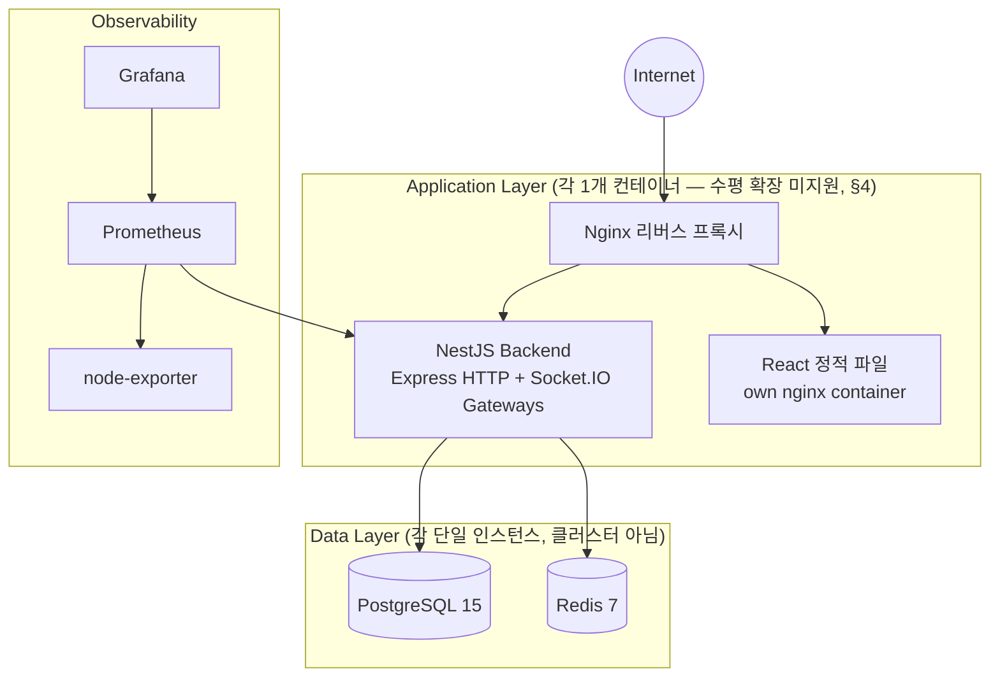
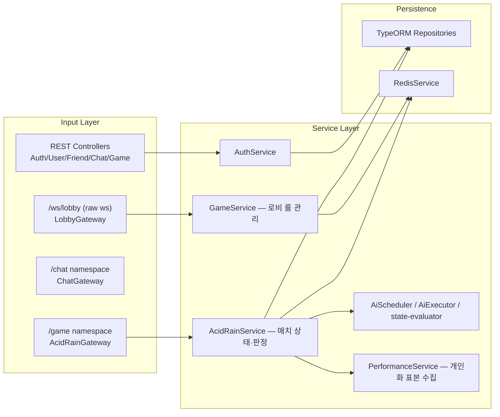

# System Architecture (실제 구현 기준, 2026-08-14)

> **전면 재작성**: 이전 버전은 Daphne ASGI/Django Channels/DRF/Celery/Redis Cluster로 구성된
> 스택을 정본으로 서술하고 있었지만, 이 프로젝트 코드베이스 어디에도(`transcendence_backend`,
> `transcendence_frontend`, `.py` 파일 포함) 그런 스택이 존재한 적이 없다 — 전체 검색 결과
> Django/Celery/Daphne 문자열이 0건이었다. 실제 스택은 NestJS 단일 프로세스 백엔드다. 문서는
> 코드에 실제로 있는 것만 서술하도록 완전히 다시 썼다.

## 1. Physical Topology (실제 `docker-compose.yml` 기준)



컨테이너 목록(`docker-compose.yml`): `db`(postgres:15-alpine), `redis`(redis:7-alpine),
`backend`(NestJS, `transcendence_backend/Dockerfile`), `frontend`(React 정적 빌드,
`transcendence_frontend/Dockerfile`), `nginx`(리버스 프록시), `prometheus`, `node-exporter`,
`grafana`. **모든 서비스가 정확히 1개 컨테이너**로 떠 있다 — 로드밸런서 뒤에 백엔드를 여러 대
띄우는 구성은 존재하지 않는다.

## 2. Backend Logical Architecture (NestJS 모듈 — 헥사고날 아님)



이전 문서가 서술한 "Battle Logic"/"Dice Engine"/"Phase Manager" 같은 포트-어댑터 분리형
도메인 코어는 존재하지 않는다 — 실제로는 일반적인 NestJS 계층 구조로, `AcidRainService`가
TypeORM 리포지토리와 `RedisService`를 직접 주입받아 쓰는 평범한 서비스 계층이다("Modular
Monolith"라는 이름은 맞지만, 엄밀한 Hexagonal/Ports-and-Adapters 패턴은 적용되지 않았다 —
ADR.md ADR-002 참고).

## 3. 실시간 게임 상태의 실제 저장 위치 — 이 문서에서 가장 중요한 정정

이전 문서는 "진행 중 게임 상태는 Redis(Cluster)에 보관하고 최종 결과만 PostgreSQL에 기록한다"고
서술했지만, **실제 권위 있는(authoritative) 상태는 Node.js 프로세스 메모리에 있다**:

```ts
// acid-rain.service.ts
private readonly sessions = new Map<string, AcidRainSession>();
```

- 매치 진행 중의 모든 판정(단어 스폰, 정오답 판정, HP, 레인 배정, 탈락, 랭킹)은 이 인메모리
  `Map`을 직접 읽고 쓴다. Redis(`persistSession()`, 키 `game:acidroom:{roomId}`)는 **재접속
  복구/관전 스냅샷을 위한 백업 직렬화본**이지, 판정의 원본이 아니다.
- Socket.IO 자체도 Redis 어댑터(`@socket.io/redis-adapter` 등)로 구성되지 않았다 — 소켓 룸
  멤버십과 브로드캐스트는 단일 프로세스 메모리 안에서만 작동한다.

**결론적으로 백엔드는 현재 정확히 1개 인스턴스로만 실행될 수 있다.** 컨테이너를 2개 이상
띄우면 같은 방의 참가자가 서로 다른 인스턴스에 붙을 경우 판정 순서가 깨지고, 인메모리 세션이
인스턴스마다 따로 놀아 즉시 게임이 망가진다. 이전 문서의 "Daphne 서버를 여러 컨테이너로 띄워
Redis Channel Layer로 메시지 공유" 서술은 실제로 뒷받침하는 코드가 전혀 없는 허구였다. 이
제약과 향후 방향은 `ADR.md`의 신규 ADR 항목에 기록한다.

## 4. Scalability & HA (실제 상태)

- **현재 수평 확장 미지원** — 위 §3 참고. 백엔드를 여러 대로 늘리려면 최소한 Socket.IO Redis
  어댑터 + 게임 세션 상태의 Redis(또는 다른 공유 저장소) 이전이 선행돼야 한다.
- **Redis/PostgreSQL 모두 단일 인스턴스** — Sentinel, Read Replica, 클러스터링 어느 것도
  `docker-compose.yml`에 구성돼 있지 않다. Redis가 죽으면 재접속 복구(`state_sync`)와 로비
  룸 상태가 즉시 영향을 받는다(인메모리 매치 자체는 살아있지만).
- **체크포인팅 시스템(`game_checkpoints` 테이블, 액션 로그 재생)은 구현된 적이 없다** — 예전
  ADR 003/004가 제안했던 설계이지 실제 마이그레이션이나 코드에 해당 테이블/로직이 없다.
- **Monitoring**: Prometheus + node-exporter + Grafana는 실제로 구성돼 있다(§1) —
  이 부분은 이전 문서 서술과 일치한다. 백엔드는 `GET /metrics`(접두사 없음,
  `API_SPECIFICATION.md` §3.1)로 커스텀 메트릭(활성 게임 수, 단어 판정 카운터 등)을 노출한다.

## 5. 컨테이너 간 인증/네트워크

- 모든 서비스는 `transcendence_net` 도커 브리지 네트워크 하나에 속한다.
- 백엔드는 `JWT_SECRET` 환경변수 기반 JWT를 발급/검증한다(`API_SPECIFICATION.md` §3).
- 42 OAuth(`FT_CLIENT_ID`/`FT_CLIENT_SECRET`/`FT_CALLBACK_URL`)가 실제로 설정돼 있다.
