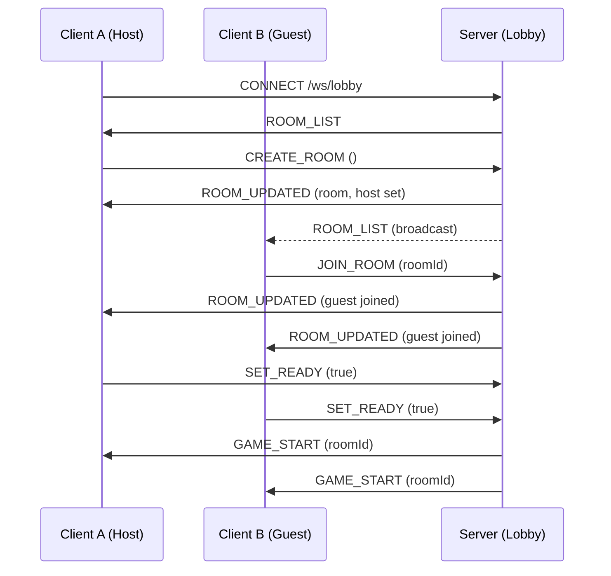
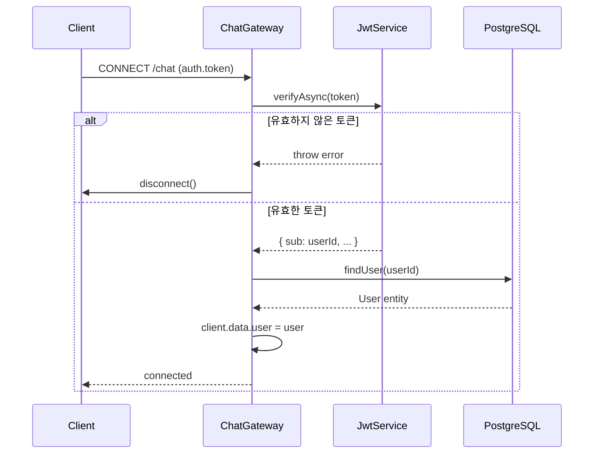
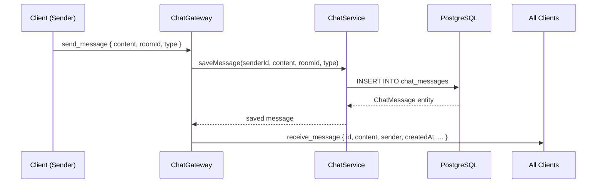
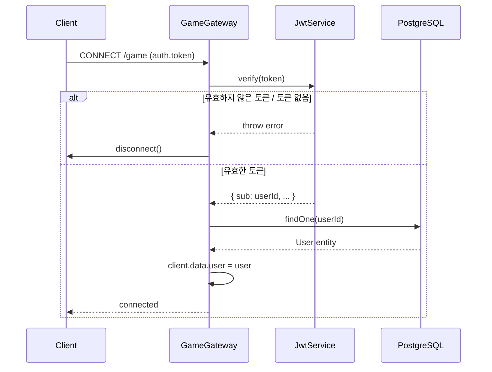
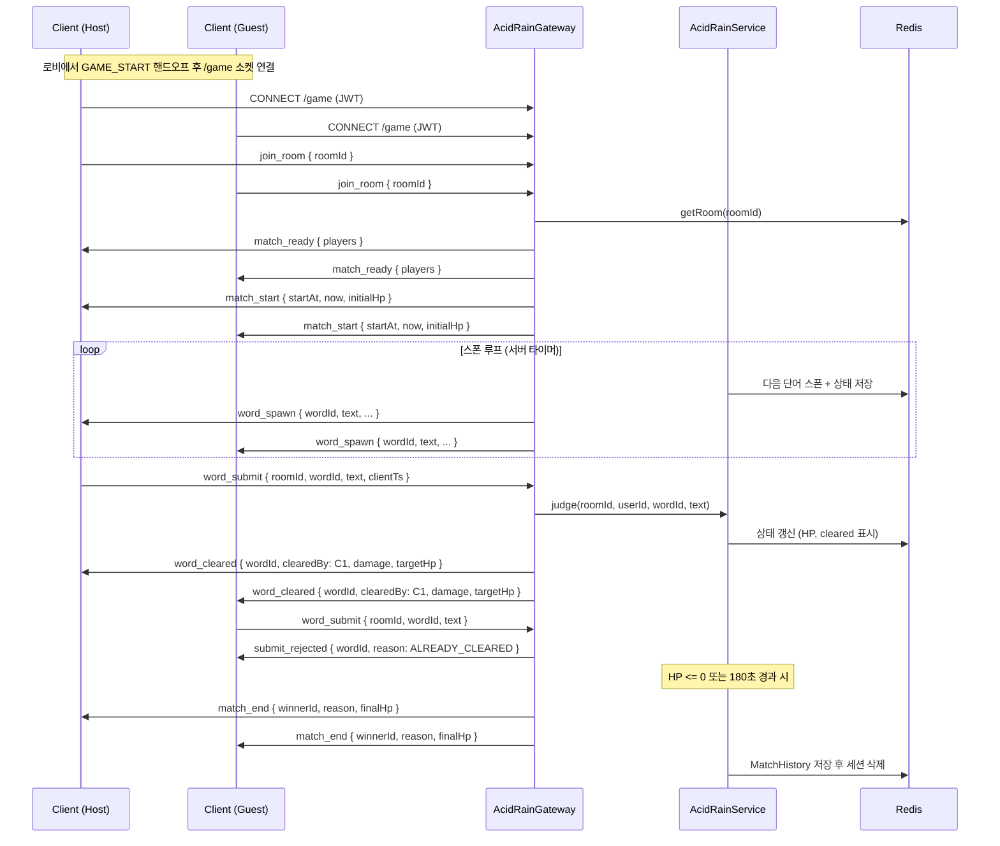

# Game Sync Protocol & WebSocket Sequence (산성비 Acid Rain)

## 0. Lobby & Room Management Protocol
`/ws/game/{room_id}` 연결 이전, 로비 화면은 별도 엔드포인트 `/ws/lobby`에 연결하여 방 목록과 입장/대기 상태를 동기화함. 메시지 envelope은 [3. Message Envelope Design](#3-message-envelope-design)과 동일한 `{ type, payload, seq }` 구조를 따름. (백엔드 구현 완료 — `transcendence_backend/src/lobby/` 참고, backend PR #64)

방 멤버십(host/guest)은 WebSocket 연결 인스턴스가 아니라 인증된 사용자(JWT)를 기준으로 서버에 보관됨. 따라서 클라이언트가 로비 화면에서 대기실 화면으로 이동하며 소켓을 재연결해도, 서버는 토큰으로 사용자를 식별해 기존 방 소속 상태를 유지하고 `GET_ROOM`에 응답할 수 있어야 함.

### 0.1. Room Object
```json
{
  "id": "room-uuid",
  "host": { "userId": "uuid", "nickname": "host_nick", "ready": false },
  "guest": { "userId": "uuid", "nickname": "guest_nick", "ready": false } | null,
  "status": "WAITING | IN_GAME",
  "createdAt": "2026-06-22T10:00:00Z"
}
```

### 0.2. Client → Server Messages
| Type | Payload | Description |
| :--- | :--- | :--- |
| `LIST_ROOMS` | `{}` | 현재 방 목록 스냅샷 요청 (연결 시 자동 수신도 됨) |
| `CREATE_ROOM` | `{}` | 새 방 생성, 본인이 host가 됨 |
| `JOIN_ROOM` | `{ roomId }` | 대기중인 방에 guest로 입장 |
| `GET_ROOM` | `{ roomId }` | 특정 방의 현재 상태 조회. 인증된 사용자가 이미 host/guest로 등록된 방이면 즉시 `ROOM_UPDATED` 응답 (대기실 페이지 진입/재연결 시 사용) |
| `LEAVE_ROOM` | `{ roomId }` | 방 퇴장 (host 퇴장 시 방 폭파) |
| `SET_READY` | `{ roomId, ready }` | 준비 완료/취소 토글 |

### 0.3. Server → Client Messages
| Type | Payload | Description |
| :--- | :--- | :--- |
| `ROOM_LIST` | `{ rooms: Room[] }` | 전체 방 목록 (연결 시 + 변경 발생 시 broadcast) |
| `ROOM_UPDATED` | `{ room: Room }` | 특정 방의 상태 변경 (입장/준비 상태) |
| `ROOM_CLOSED` | `{ roomId }` | 방 삭제 (host 퇴장 등) |
| `GAME_START` | `{ roomId }` | host/guest 모두 ready 시 발송, 클라이언트는 `/ws/game/{roomId}`로 전환 |
| `ACTION_REJECTED` | `{ message }` | 잘못된 요청(예: 이미 가득 찬 방 입장 시도) |

### 0.4. Sequence


## Message Envelope Design (Lobby raw-ws 전용)
§0(로비, raw WebSocket)의 모든 메시지는 다음 구조를 따름. §5(채팅)·§6(게임)은 Socket.io named event +
플랫 payload 방식이라 이 봉투를 쓰지 않음.

\`\`\`json
{
  "type": "ACTION_REJECTED, STATE_UPDATE, NOTIFICATION",
  "payload": { ... },
  "seq": 102  // 클라이언트 측 메시지 순서 보장용 시퀀스 번호
}
\`\`\`

## Reconnection Logic (일반 원칙)
아래는 Redis 기반 실시간 세션 전반에 적용되는 일반 원칙이다. 게임(산성비) 세션의 구체적인 키/TTL/유예
시간은 §6.3을 따른다.

- **Heartbeat**: 5초마다 PING/PONG 체크.
- **State Recovery**: 재접속 시 서버는 Redis에 보관된 최신 세션 상태 전체를 다시 전송함.

- **Cluster & Checkpoint-aware Recovery**:
  - 클러스터 환경에서는 Redis 접근 중 `MOVED`/`ASK` 응답이나 일시적 접근 불가가 발생할 수 있으므로 서버는 클러스터-aware 클라이언트로 토폴로지 갱신과 자동 재시도를 수행합니다.
  - 재접속 시 서버가 Redis에서 세션 상태 키(예: 게임 세션은 §6.3의 `game:acidroom:{roomId}`)를 찾지 못하거나 접근 오류가 발생하면 다음 순서로 복구를 시도합니다:
    1. 클러스터 클라이언트에서 `MOVED`/`ASK`를 처리하여 재요청(토폴로지 갱신 포함)을 시도합니다.
    2. 재시도 실패 시 PostgreSQL에 저장된 최신 체크포인트(`game_checkpoints` 테이블)를 가져와 세션 상태를 복원합니다.
    3. 체크포인트와 함께 보관된 액션 로그(가능한 경우 Redis Streams 또는 영속 로그)를 재생하여 최신 상태로 보완합니다.
  - 복구 시도는 지수 백오프(예: 초기 100ms, 최대 2s)와 최대 재시도 횟수(예: 5회)를 적용합니다. 모든 시도가 실패하면 서버는 사용자에게 복구 불가 알림을 보내거나 세션을 안전하게 종료합니다.
  - 복구 과정은 메트릭으로 수집합니다: 복구 성공률, 체크포인트 활용률, 재시도 횟수, 복구 지연 등을 모니터링합니다.

---

## 5. Chat Namespace (`/chat`)

### 5.1 연결 인증

Chat WebSocket은 `/chat` namespace에서 동작합니다. 연결 시 반드시 JWT 토큰을 전달해야 합니다.

```json
// 핸드셰이크 auth payload
{
  "auth": {
    "token": "Bearer <JWT_ACCESS_TOKEN>"
  }
}
```

또는 쿼리 파라미터로 전달:

```
/chat?token=Bearer <JWT_ACCESS_TOKEN>
```

토큰이 없거나 유효하지 않으면 서버가 즉시 소켓을 disconnect합니다.

### 5.2 이벤트 정의

#### 클라이언트 → 서버: `send_message`

```json
{
  "content": "안녕하세요!",
  "roomId": "optional-room-id",
  "type": "NORMAL"
}
```

| 필드 | 타입 | 필수 | 설명 |
|------|------|------|------|
| `content` | string | ✓ | 메시지 내용 (비어있을 수 없음) |
| `roomId` | string | - | 특정 채팅방 ID (없으면 글로벌 채널) |
| `type` | `"NORMAL"` \| `"INVITE"` | - | 메시지 유형 (기본값: `"NORMAL"`) |

#### 서버 → 전체 클라이언트: `receive_message`

```json
{
  "id": "uuid-v4",
  "content": "안녕하세요!",
  "roomId": null,
  "type": "NORMAL",
  "createdAt": "2026-06-22T12:00:00.000Z",
  "sender": {
    "id": "user-uuid",
    "nickname": "player1"
  }
}
```

### 5.3 연결 시퀀스



### 5.4 메시지 흐름



### 5.5 REST 보완 API

채팅 히스토리는 WebSocket 외 REST API로도 조회 가능합니다 (JWT 인증 필요).

```
GET /api/chat/history
```

→ 최근 50개 메시지를 `createdAt` 오름차순으로 반환. 상세 스펙은 `API_SPECIFICATION.md` 참조.

---

## 6. Game Namespace (`/game`)

### 6.1 연결 인증

Game WebSocket은 `/game` namespace에서 동작하며, 인증 방식은 `/chat`(5.1)과 동일한 컨벤션을 따릅니다 — 핸드셰이크 `auth.token` 또는 `?token=` 쿼리 파라미터로 `Bearer <JWT_ACCESS_TOKEN>` 전달. 토큰이 없거나 유효하지 않으면 서버가 즉시 소켓을 disconnect합니다.

두 네임스페이스의 공통 토큰 추출 로직은 `src/common/websocket/ws-jwt.util.ts`의 `extractWsToken()`을 공유합니다 (현재 `/game`에서 사용 중이며, `/chat`도 동일 컨벤션이라 추후 이 유틸로 통합 가능).

### 6.2 연결 시퀀스



### 6.3 이벤트 정의 — 산성비(Acid Rain) 타자 대전 (설계 확정, 구현 예정)

규칙 상세는 `GAME_DESIGN.md`를 정본으로 한다.

Socket.io 룸 키: `game:{roomId}` (서버 내부 브로드캐스트 채널)

Redis 세션 키: `game:acidroom:{roomId}` (TTL: **1800s(30분)** — 매치 최대 180초 + 재접속 유예 30초
기준으로 설정)

서버는 스폰 타이밍/순서와 정오답 판정을 전적으로 결정하는 **권위 서버**다. 클라이언트는 로컬 타이머로
판정하지 않고, 서버가 보낸 이벤트만 신뢰하며 `now`(서버 시각) 필드로 클록 오차를 보정한다.

#### 클라이언트 → 서버

| Event | Payload | Description |
|---|---|---|
| `join_room` | `{ roomId: string }` | 소켓 룸 입장/재입장. 두 플레이어 모두 입장하면 `match_ready` 브로드캐스트 |
| `leave_room` | `{ roomId: string }` | 명시적 퇴장 (매치 진행 중이면 몰수패 처리) |
| `word_submit` | `{ roomId: string, wordId: string, text: string, clientTs: number }` | 단어 입력 제출. `clientTs`는 지연시간 텔레메트리용이며 판정에는 사용하지 않음. 서버는 `wordId`+유저 기준으로 멱등 처리(재전송해도 중복 판정 없음) |

#### 서버 → 클라이언트

| Event | Payload | Description |
|---|---|---|
| `match_ready` | `{ roomId, protocolVersion, players: { host: PlayerPublic, guest: PlayerPublic } }` | 양쪽 소켓 룸 입장 완료, 카운트다운 시작 신호 |
| `match_start` | `{ roomId, startAt, now, initialHp }` | 동기화된 매치 시작. `now`(서버 현재 시각)로 클라이언트 클록 오차 보정 |
| `word_spawn` | `{ wordId, text, tier, fallDurationMs, spawnedAt }` | 양쪽 클라이언트에 동일하게 브로드캐스트되는 단어 스트림 |
| `word_cleared` | `{ wordId, clearedBy, damage, targetHp: { host, guest } }` | 누군가 먼저 정확히 입력해 단어가 지워짐. 상대방에게 데미지 적용 |
| `word_missed` | `{ wordId, splashDamage, targetHp: { host, guest } }` | 아무도 못 지운 단어가 바닥에 닿음. 양쪽 모두 데미지 |
| `submit_rejected` | `{ wordId, reason: 'ALREADY_CLEARED' \| 'NOT_FOUND' \| 'WRONG_TEXT' }` | 제출자에게만 전송(레이스 패배/오타) |
| `state_sync` | `{ roomId, hp: { host, guest }, activeWords: WordSpawnPayload[], elapsedMs, spawnIntervalMs, now }` | 재접속 시 전체 스냅샷 |
| `opponent_disconnected` | `{ userId, graceMs: 30000 }` | 상대 연결 끊김, 유예 시작 |
| `opponent_reconnected` | `{ userId }` | 유예 중 상대 복귀 |
| `match_end` | `{ roomId, winnerId, reason: 'KO' \| 'TIME_LIMIT' \| 'FORFEIT', finalHp: { host, guest } }` | 매치 종료 |
| `error` | `{ message: string }` | 인증/검증 실패 등 일반 오류 |

`PlayerPublic = { userId, nickname }`.

#### `word_spawn` payload 예시

```json
{
  "wordId": "w_7f3a",
  "text": "산성비",
  "tier": "medium",
  "fallDurationMs": 4900,
  "spawnedAt": "2026-07-19T10:00:03.120Z"
}
```

#### `word_cleared` / `word_missed` payload 예시

```json
{ "wordId": "w_7f3a", "clearedBy": "user-uuid-host", "damage": 8, "targetHp": { "host": 100, "guest": 92 } }
```
```json
{ "wordId": "w_9b21", "splashDamage": 3, "targetHp": { "host": 97, "guest": 89 } }
```

#### `state_sync` payload 예시 (재접속 복구)

```json
{
  "roomId": "room-uuid",
  "hp": { "host": 82, "guest": 91 },
  "activeWords": [
    { "wordId": "w_c410", "text": "타자", "tier": "easy", "fallDurationMs": 4600, "spawnedAt": "2026-07-19T10:01:10.000Z" }
  ],
  "elapsedMs": 47000,
  "spawnIntervalMs": 1650,
  "now": "2026-07-19T10:01:12.400Z"
}
```

#### 레이스 컨디션 & 재접속 처리

- 서버는 방 단위로 `word_submit`을 도착 순서대로 처리한다. 특정 `wordId`가 이미 `cleared`면 이후
  도착하는 모든 제출은 `submit_rejected{reason:'ALREADY_CLEARED'}`.
  > 이 순서 보장은 **백엔드 인스턴스 1대** 기준이다. Socket.io를 여러 인스턴스로 수평 확장할 경우
  > Redis adapter로 브로드캐스트해도 같은 방의 두 클라이언트가 서로 다른 인스턴스에 붙어있으면 판정
  > 순서가 보장되지 않는다 — 확장 시 방 단위 sticky 라우팅 또는 Redis 기반 분산 락이 필요하다.
- `disconnect` 시 30초 유예: 방 유지 + 상대에게 `opponent_disconnected` 알림. 유예 내 `join_room`
  재전송 시 `state_sync`로 복구, 유예 만료 시 상대 승리(`match_end{reason:'FORFEIT'}`).

#### 게임 흐름 시퀀스



### 6.4 전적 통계 & 리더보드 REST API (P3-08)

게임 종료 시 `MatchHistory`에 기록되며, 아래 REST API로 조회합니다.

| Method | Path | Description |
|---|---|---|
| `GET` | `/api/game/users/:id/stats` | 전적 통계 (wins, losses, winRate, totalGames) |
| `GET` | `/api/game/users/:id/matches` | 매치 히스토리 목록 (query: `page`, `limit`) |
| `GET` | `/api/game/leaderboard` | 승률 기준 상위 10명 |

**stats 응답 예시:**
```json
{ "data": { "wins": 5, "losses": 3, "totalGames": 8, "winRate": 0.63 } }
```

**leaderboard 응답 예시:**
```json
{
  "data": [
    { "id": "uuid", "nickname": "player1", "wins": 10, "losses": 2, "totalGames": 12, "winRate": 0.83 }
  ]
}
```

### 6.5 구현 상태 (2026-07-19 기준)

산성비 스키마는 **설계 확정, 구현 착수 전** 상태다.

| 항목 | 현재 상태 |
|---|---|
| `AcidRainGateway`(`/game` 네임스페이스, §6.3 이벤트) | 미구현 (설계만 확정) |
| `AcidRainService`(스폰 루프, HP/데미지, Redis `game:acidroom:{roomId}`) | 미구현 |
| `word-bank.ts`(한국어 단어 큐레이션) | 미구현 |
| 로비의 룸 관리 로직(`createRoom`/`joinRoom`/`setReady` 등) | 유지 — 로비가 의존하는 범용 로직 |
| REST 방 엔드포인트(`POST rooms`, `POST rooms/:id/join` 등) | 삭제 예정 (실사용처 없음 확인됨) |

### 6.6 프론트엔드 구현 파일 (계획)

| 파일 | 역할 | 상태 |
|---|---|---|
| `src/context/GameSocketContext.tsx` | 소켓 연결/인증 상태 관리, Provider | 유지 |
| `src/hooks/useAcidRainSocket.ts` | roomId별 join/leave + §6.3 이벤트 핸들러 구독 | 신규 |
| `src/types/acidRain.ts` | §6.3 이벤트 페이로드 타입 + Server/ClientToServerEvents 맵 | 신규 |
| `src/pages/GameBoardPage.tsx` | 게임 보드 페이지, `/game/:roomId` — 단어 낙하 렌더링 + 입력창 + HP 바 | 재작성 |
| `src/pages/GameComingSoonPage.tsx` | 배포 공백을 메우는 placeholder | 신규(임시) |
