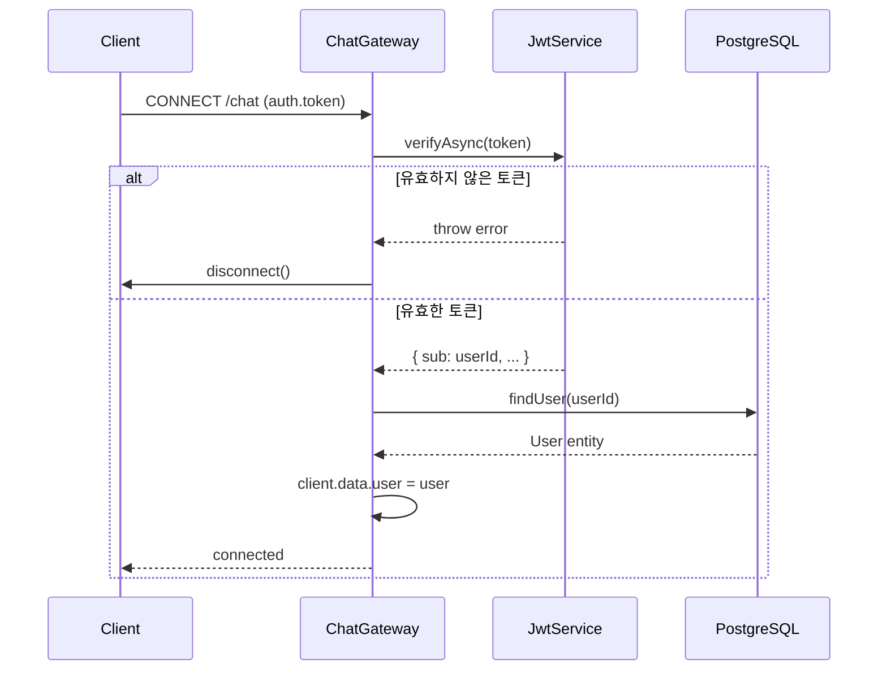
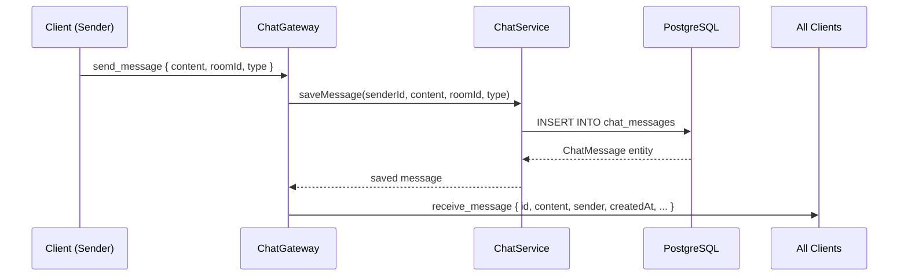

# Game Sync Protocol & WebSocket Sequence (v2)

## 1. Game Start Sequence
서버와 클라이언트 간의 초기 연결 및 동기화 프로세스입니다.

\`\`\`mermaid
sequenceDiagram
    participant C1 as Client A (Host)
    participant C2 as Client B (Guest)
    participant S as Server (Channels)
    participant R as Redis

    C1->>S: CONNECT /ws/game/{room_id}
    C2->>S: CONNECT /ws/game/{room_id}
    S->>R: CHECK_ROOM_READY
    R-->>S: READY
    S->>C1: MSG: GAME_START (Initial Deck Info)
    S->>C2: MSG: GAME_START (Initial Deck Info)
    S->>C1: MSG: PHASE_UPDATE (DRAW)
    S->>C2: MSG: PHASE_UPDATE (DRAW)
\`\`\`

## 2. In-Game Phase Sync (Move Phase)
이동 페이즈에서의 동기화 예시입니다.

\`\`\`mermaid
sequenceDiagram
    participant C1 as Client A
    participant S as Server
    participant C2 as Client B

    C1->>S: SEND_ACTION (MOVE_CARDS: [4, 7])
    S->>S: VALIDATE_OWNERSHIP & RULES
    Note over S: Client B is still thinking...
    C2->>S: SEND_ACTION (MOVE_CARDS: [2])
    S->>S: COMPUTE_RESULT (Distance, Initiative)
    S->>C1: BROADCAST: MOVE_RESULT (New Dist: 1, Init: A)
    S->>C2: BROADCAST: MOVE_RESULT (New Dist: 1, Init: A)
    S->>C1: BROADCAST: PHASE_UPDATE (ATTACK)
    S->>C2: BROADCAST: PHASE_UPDATE (ATTACK)
\`\`\`

## 3. Message Envelope Design
모든 WebSocket 메시지는 다음 구조를 따름.

\`\`\`json
{
  "type": "ACTION_REJECTED, STATE_UPDATE, NOTIFICATION",
  "payload": { ... },
  "seq": 102  // 클라이언트 측 메시지 순서 보장용 시퀀스 번호
}
\`\`\`

## 4. Reconnection Logic
- **Heartbeat**: 5초마다 PING/PONG 체크.
- **State Recovery**: 재접속 시 서버는 Redis에 보관된 최신 \`room_state\` 전체를 다시 전송함.
- **Grace Period**: 연결 유실 후 15초 내 미복구 시 몰수패 처리.

- **Cluster & Checkpoint-aware Recovery**:
  - 클러스터 환경에서는 Redis 접근 중 `MOVED`/`ASK` 응답이나 일시적 접근 불가가 발생할 수 있으므로 서버는 클러스터-aware 클라이언트로 토폴로지 갱신과 자동 재시도를 수행합니다.
  - 재접속 시 서버가 Redis에서 `room:{id}:state` 키를 찾지 못하거나 접근 오류가 발생하면 다음 순서로 복구를 시도합니다:
    1. 클러스터 클라이언트에서 `MOVED`/`ASK`를 처리하여 재요청(토폴로지 갱신 포함)을 시도합니다.
    2. 재시도 실패 시 PostgreSQL에 저장된 최신 체크포인트(`game_checkpoints` 테이블)를 가져와 세션 상태를 복원합니다.
    3. 체크포인트와 함께 보관된 액션 로그(가능한 경우 Redis Streams 또는 영속 로그)를 재생하여 최신 상태로 보완합니다.
  - 복구 시도는 지수 백오프(예: 초기 100ms, 최대 2s)와 최대 재시도 횟수(예: 5회)를 적용합니다. 모든 시도가 실패하면 서버는 사용자에게 복구 불가 알림을 보내거나 세션을 안전하게 종료합니다.
  - 복구 과정은 메트릭으로 수집합니다: 복구 성공률, 체크포인트 활용률, 재시도 횟수, 복구 지연 등을 모니터링합니다.

---

## 5. Chat Namespace (`/chat`)

### 5.1 연결 인증

Chat WebSocket은 `/chat` namespace에서 동작합니다. 연결 시 반드시 JWT 토큰을 전달해야 합니다.

```json
// 핸드셰이크 auth payload
{
  "auth": {
    "token": "Bearer <JWT_ACCESS_TOKEN>"
  }
}
```

또는 쿼리 파라미터로 전달:

```
/chat?token=Bearer <JWT_ACCESS_TOKEN>
```

토큰이 없거나 유효하지 않으면 서버가 즉시 소켓을 disconnect합니다.

### 5.2 이벤트 정의

#### 클라이언트 → 서버: `send_message`

```json
{
  "content": "안녕하세요!",
  "roomId": "optional-room-id",
  "type": "NORMAL"
}
```

| 필드 | 타입 | 필수 | 설명 |
|------|------|------|------|
| `content` | string | ✓ | 메시지 내용 (비어있을 수 없음) |
| `roomId` | string | - | 특정 채팅방 ID (없으면 글로벌 채널) |
| `type` | `"NORMAL"` \| `"INVITE"` | - | 메시지 유형 (기본값: `"NORMAL"`) |

#### 서버 → 전체 클라이언트: `receive_message`

```json
{
  "id": "uuid-v4",
  "content": "안녕하세요!",
  "roomId": null,
  "type": "NORMAL",
  "createdAt": "2026-06-22T12:00:00.000Z",
  "sender": {
    "id": "user-uuid",
    "nickname": "player1"
  }
}
```

### 5.3 연결 시퀀스



### 5.4 메시지 흐름



### 5.5 REST 보완 API

채팅 히스토리는 WebSocket 외 REST API로도 조회 가능합니다 (JWT 인증 필요).

```
GET /api/chat/history
```

→ 최근 50개 메시지를 `createdAt` 오름차순으로 반환. 상세 스펙은 `API_SPECIFICATION.md` 참조.
