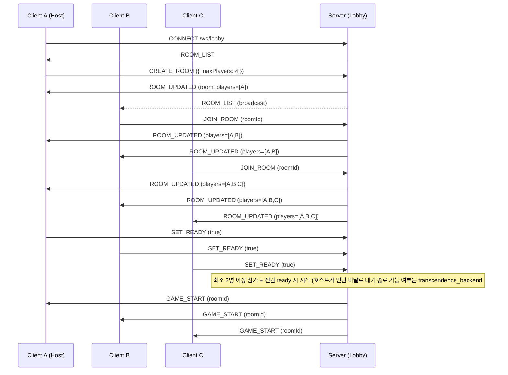
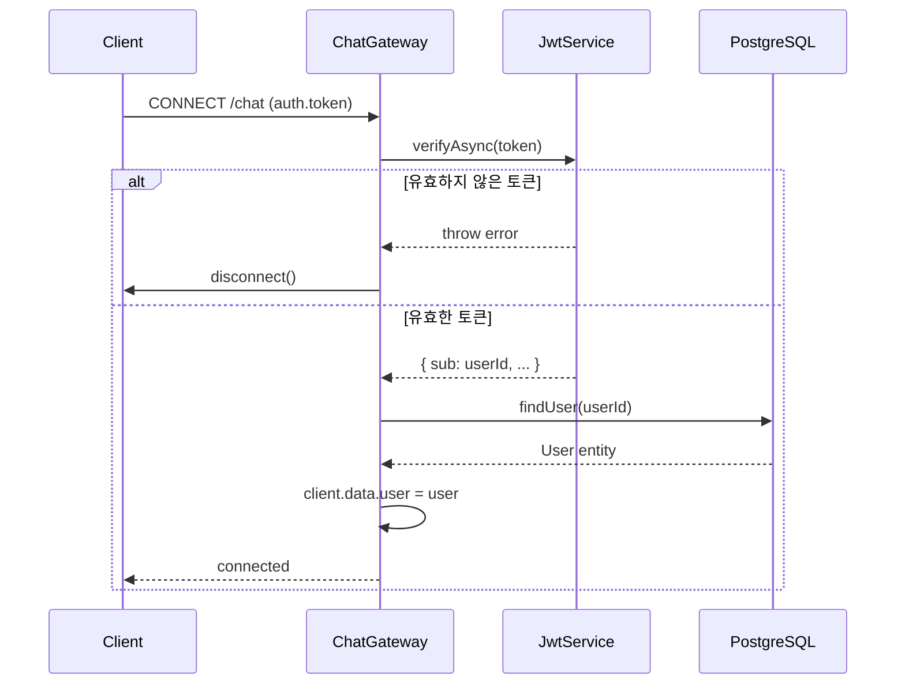
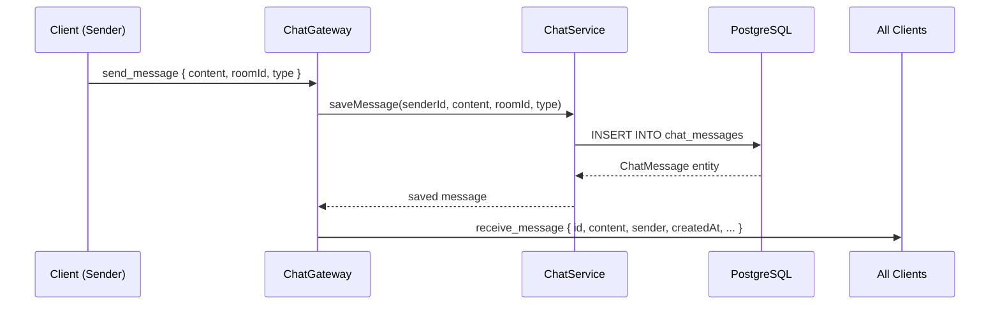
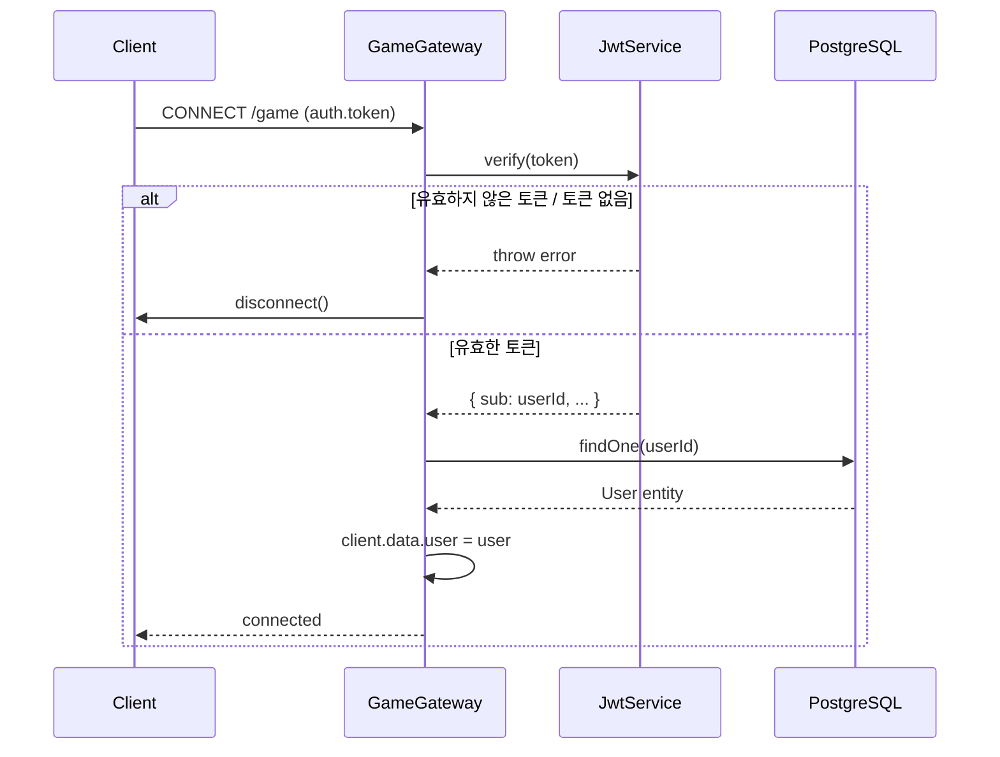
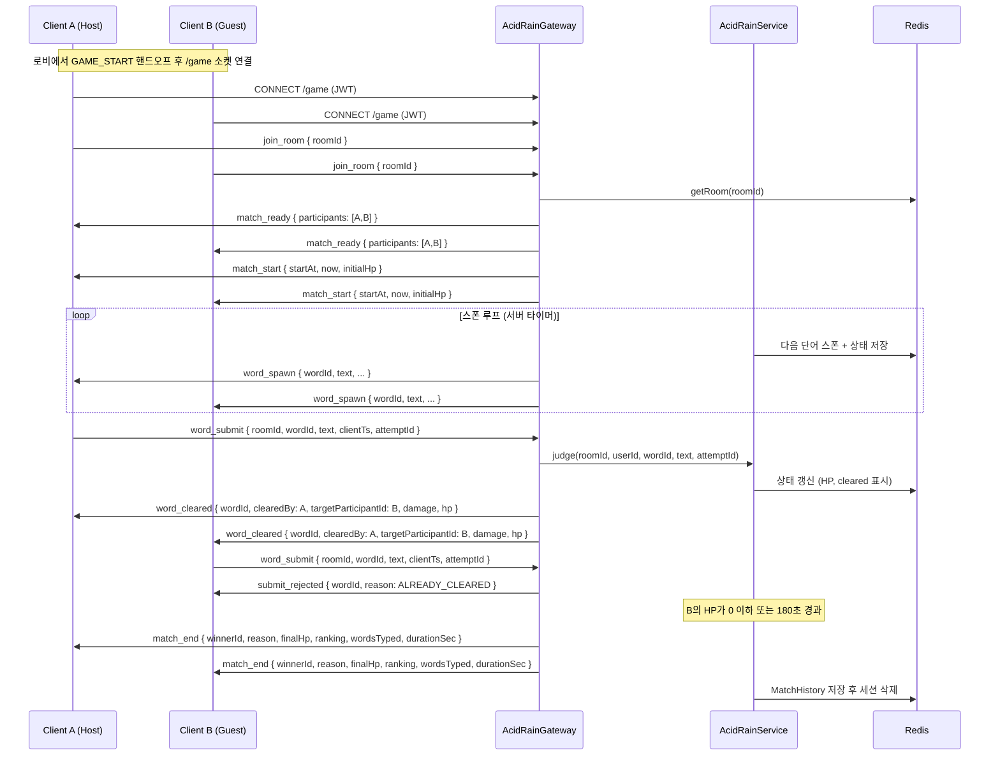
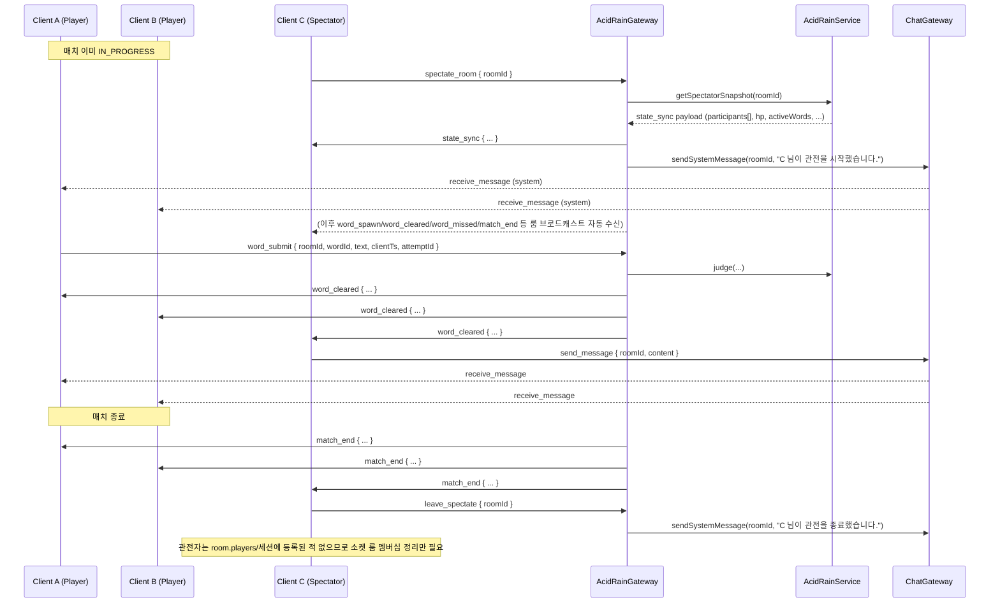

# Game Sync Protocol & WebSocket Sequence (산성비 Acid Rain)

## 0. Lobby & Room Management Protocol
`/ws/game/{room_id}` 연결 이전, 로비 화면은 별도 엔드포인트 `/ws/lobby`에 연결하여 방 목록과 입장/대기 상태를 동기화함. 메시지 envelope은 [3. Message Envelope Design](#3-message-envelope-design)과 동일한 `{ type, payload, seq }` 구조를 따름. (백엔드 구현 완료 — `transcendence_backend/src/lobby/` 참고, backend PR #64)

방 멤버십(`players[]`, §0.1)은 WebSocket 연결 인스턴스가 아니라 인증된 사용자(JWT)를 기준으로 서버에 보관됨. 따라서 클라이언트가 로비 화면에서 대기실 화면으로 이동하며 소켓을 재연결해도, 서버는 토큰으로 사용자를 식별해 기존 방 소속 상태를 유지하고 `GET_ROOM`에 응답할 수 있어야 함.

### 0.1. Room Object

> **갱신 (2026-08-11, `transcendence_deploy#92`)**: `host`/`guest` 2슬롯 고정 구조를 `players[]`
> 배열(2~4명)로 확장한다.
> 방을 만든 사람의 방 관리 권한(강퇴/방 폭파)은 `hostUserId`로 유지한다. 아래가 정본이며, 구현은
> `transcendence_backend#95`(로비 룸 모델 확장)가 담당한다.

```json
{
  "id": "room-uuid",
  "hostUserId": "uuid",
  "maxPlayers": 4,
  "players": [
    { "userId": "uuid", "nickname": "host_nick", "ready": false },
    { "userId": "uuid", "nickname": "guest_nick", "ready": false }
  ],
  "status": "WAITING | IN_GAME",
  "createdAt": "2026-06-22T10:00:00Z"
}
```

`players`는 최소 1명(호스트만 입장한 상태)부터 `maxPlayers`(2~4, 기본 4)까지 담을 수 있다. 배열의
첫 원소가 항상 호스트라는 보장은 없으므로, 호스트 판별은 반드시 `hostUserId`와 `userId`를 비교해서
한다.

### 0.2. Client → Server Messages
| Type | Payload | Description |
| :--- | :--- | :--- |
| `LIST_ROOMS` | `{}` | 현재 방 목록 스냅샷 요청 (연결 시 자동 수신도 됨) |
| `CREATE_ROOM` | `{ maxPlayers? }` | 새 방 생성, 본인이 호스트가 됨. `maxPlayers`는 2~4(기본 4), 생략 시 기본값 |
| `JOIN_ROOM` | `{ roomId }` | 대기중인 방에 참가자로 입장. `players.length >= maxPlayers`면 `ACTION_REJECTED{message:'Room is already full'}` |
| `GET_ROOM` | `{ roomId }` | 특정 방의 현재 상태 조회. 인증된 사용자가 이미 `players`에 등록된 방이면 즉시 `ROOM_UPDATED` 응답 (대기실 페이지 진입/재연결 시 사용) |
| `LEAVE_ROOM` | `{ roomId }` | 방 퇴장 (호스트 퇴장 시 방 폭파 — 호스트 위임은 `transcendence_backend#68` 별도 이슈) |
| `SET_READY` | `{ roomId, ready }` | 준비 완료/취소 토글 |

### 0.3. Server → Client Messages
| Type | Payload | Description |
| :--- | :--- | :--- |
| `ROOM_LIST` | `{ rooms: Room[] }` | 전체 방 목록 (연결 시 + 변경 발생 시 broadcast) |
| `ROOM_UPDATED` | `{ room: Room }` | 특정 방의 상태 변경 (입장/준비 상태) |
| `ROOM_CLOSED` | `{ roomId }` | 방 삭제 (호스트 퇴장 등) |
| `GAME_START` | `{ roomId }` | 방 인원 전원(2~4명)이 ready 시 발송, 클라이언트는 `/ws/game/{roomId}`로 전환 |
| `ACTION_REJECTED` | `{ message }` | 잘못된 요청(예: 가득 찬 방 입장 시도, 최소 인원(2명) 미만인 상태로 SET_READY 시도) |

### 0.4. Sequence (2~4인, 3인 입장 예시)


## Message Envelope Design (Lobby raw-ws 전용)
§0(로비, raw WebSocket)의 모든 메시지는 다음 구조를 따름. §5(채팅)·§6(게임)은 Socket.io named event +
플랫 payload 방식이라 이 봉투를 쓰지 않음.

\`\`\`json
{
  "type": "ACTION_REJECTED, STATE_UPDATE, NOTIFICATION",
  "payload": { ... },
  "seq": 102  // 클라이언트 측 메시지 순서 보장용 시퀀스 번호
}
\`\`\`

## Reconnection Logic (실제 구현, `ADR.md` ADR-003/ADR-005 참고)

> **정정 (2026-08-14)**: 아래는 실제로 구현된 적 없는 Redis Cluster `MOVED`/`ASK` 처리와
> `game_checkpoints` 기반 체크포인트 복구를 서술하고 있었다 — Redis는 단일 인스턴스이고,
> 게임 세션의 권위 있는 상태는 애초에 Redis가 아니라 백엔드 프로세스 메모리(`AcidRainService`의
> `Map<roomId, AcidRainSession>`)에 있다. 실제 복구 모델은 다음과 같다.

- **Heartbeat**: Socket.IO 기본 ping/pong 메커니즘을 그대로 사용한다.
- **State Recovery**: 재접속 시 서버는 **인메모리 세션**(`AcidRainService.sessions`)의 현재
  상태를 `state_sync`로 즉시 전송한다. Redis(`game:acidroom:{roomId}`)는 이 인메모리 상태의
  백업 직렬화본으로, 인메모리 세션 자체가 유실된 경우(예: 프로세스 재시작)에만 참고 대상이 될
  수 있으나, 자동으로 이를 다시 읽어 세션을 복원하는 로직은 없다.
- **그레이스 타이머 없음**: 연결이 끊겨도 매치를 일시정지하거나 강제 탈락시키지 않는다
  (`backend#161`, §6.3 "레이스 컨디션 & 재접속 처리" 절, `ADR.md` ADR-005). 재접속은 유예
  시간 제한 없이 아무 때나 `join_room` 재전송으로 가능하다.
- **알려진 한계**: 백엔드가 재시작되면 그 시점의 모든 진행 중 매치가 통째로 유실된다 — 이를
  완화하는 자동 체크포인트/복구 시스템은 제안됐었지만 구현되지 않았다(`ADR.md` ADR-005).
  또한 Socket.IO에 Redis 어댑터가 구성돼 있지 않아 백엔드는 정확히 1개 인스턴스로만 운영
  가능하다(`SYSTEM_ARCHITECTURE.md` §3/§4, `ADR.md` ADR-004).

---

## 5. Chat Namespace (`/chat`)

### 5.1 연결 인증

Chat WebSocket은 `/chat` namespace에서 동작합니다. 연결 시 반드시 JWT 토큰을 전달해야 합니다.

```json
// 핸드셰이크 auth payload
{
  "auth": {
    "token": "Bearer <JWT_ACCESS_TOKEN>"
  }
}
```

또는 쿼리 파라미터로 전달:

```
/chat?token=Bearer <JWT_ACCESS_TOKEN>
```

토큰이 없거나 유효하지 않으면 서버가 즉시 소켓을 disconnect합니다.

### 5.2 이벤트 정의

#### 클라이언트 → 서버: `send_message`

```json
{
  "content": "안녕하세요!",
  "roomId": "optional-room-id",
  "type": "NORMAL"
}
```

| 필드 | 타입 | 필수 | 설명 |
|------|------|------|------|
| `content` | string | ✓ | 메시지 내용 (비어있을 수 없음) |
| `roomId` | string | - | 특정 채팅방 ID (없으면 글로벌 채널) |
| `type` | `"NORMAL"` \| `"INVITE"` | - | 메시지 유형 (기본값: `"NORMAL"`). `"SYSTEM"`은 서버 전용이라 클라이언트가 보내면 거부된다 |

#### 서버 → 전체 클라이언트: `receive_message`

```json
{
  "id": "uuid-v4",
  "content": "안녕하세요!",
  "roomId": null,
  "type": "NORMAL",
  "createdAt": "2026-06-22T12:00:00.000Z",
  "sender": {
    "id": "user-uuid",
    "nickname": "player1"
  }
}
```

`type`은 `"NORMAL"` \| `"INVITE"` \| `"SYSTEM"` 중 하나다. `"SYSTEM"`은 특정 유저가 보낸 메시지가 아니라
서버가 생성한 알림(대기실 입장/퇴장 등, `#67`)이므로 `sender`가 `null`이다. 클라이언트는 렌더링 전에
반드시 `sender`가 `null`일 수 있음을 처리해야 한다.

```json
{
  "id": "uuid-v4",
  "content": "player1 님이 입장하셨습니다.",
  "roomId": "room-id",
  "type": "SYSTEM",
  "createdAt": "2026-06-22T12:00:00.000Z",
  "sender": null
}
```

SYSTEM 메시지는 `GET /api/chat/history`(5.5) 응답에는 포함되지 않는다 — 저장은 되지만 히스토리 조회는
`NORMAL` 타입만 반환하므로, 재접속 시 과거 입장/퇴장 알림이 다시 나타나지 않는다.

### 5.3 연결 시퀀스



### 5.4 메시지 흐름



### 5.5 REST 보완 API

채팅 히스토리는 WebSocket 외 REST API로도 조회 가능합니다 (JWT 인증 필요).

```
GET /api/chat/history
```

→ 최근 50개 메시지를 `createdAt` 오름차순으로 반환. 상세 스펙은 `API_SPECIFICATION.md` 참조.

---

## 6. Game Namespace (`/game`)

### 6.1 연결 인증

Game WebSocket은 `/game` namespace에서 동작하며, 인증 방식은 `/chat`(5.1)과 동일한 컨벤션을 따릅니다 — 핸드셰이크 `auth.token` 또는 `?token=` 쿼리 파라미터로 `Bearer <JWT_ACCESS_TOKEN>` 전달. 토큰이 없거나 유효하지 않으면 서버가 즉시 소켓을 disconnect합니다.

두 네임스페이스의 공통 토큰 추출 로직은 `src/common/websocket/ws-jwt.util.ts`의 `extractWsToken()`을 공유합니다 (현재 `/game`에서 사용 중이며, `/chat`도 동일 컨벤션이라 추후 이 유틸로 통합 가능).

### 6.2 연결 시퀀스



### 6.3 이벤트 정의 — 산성비(Acid Rain) 타자 대전 (2~4인 N인 배틀로얄, 구현 완료)

> **2026-08-14 갱신**: 이 절은 실제 코드(`transcendence_backend`의 `acid-rain.gateway.ts`/
> `acid-rain.service.ts`/`acid-rain.interface.ts`)를 기준으로 다시 작성됐다. 직전 버전은
> "현재 구현: 1:1"이라고 표기하고 N인 확장을 `backend#136` 대기 항목으로 남겨뒀지만, `backend#136`
> (전략형 다중 ACTIVE 단어 엔진)과 `backend#165`(세션 모델의 `participants[]` 배열 전면 재작성)가
> 모두 머지되어 **2~4인 배틀로얄이 실제로 동작한다** — `AcidRainSession`에는 더 이상
> `host`/`guest` 필드가 없다.

규칙 상세는 `GAME_DESIGN.md`를 정본으로 한다.

Socket.io 룸 키: `game:{roomId}` (서버 내부 브로드캐스트 채널)

Redis 세션 키: `game:acidroom:{roomId}`

서버는 스폰 타이밍/순서와 정오답 판정을 전적으로 결정하는 **권위 서버**다. 클라이언트는 로컬 타이머로
판정하지 않고, 서버가 보낸 이벤트만 신뢰하며 `now`(서버 시각) 필드로 클록 오차를 보정한다.

`participants`/`hp` 등은 `participantId` 키를 쓴다. AI 참가자(`type: 'AI'`)는 `userId`가 없다.

#### 클라이언트 → 서버

| Event | Payload | Description |
|---|---|---|
| `join_room` | `{ roomId: string }` | 소켓 룸 입장/재입장. 방 인원이 2~4명이고 전원이 소켓 룸에 입장하면 `match_ready` 브로드캐스트(2명 미만이거나 4명 초과면 거부 — `join_room rejected — unsupported player count` 로그) |
| `leave_room` | `{ roomId: string }` | 명시적 퇴장. 매치가 `IN_PROGRESS`면 해당 참가자만 즉시 탈락(`FORFEIT`) 처리 — 생존자가 1명 이하로 남을 때만 매치 자체가 끝난다. N인전에서 1명이 나가도 나머지는 계속 진행 |
| `word_submit` | `{ roomId: string, wordId: string, text: string, clientTs: number, attemptId: string }` | 단어 입력 제출. `wordId`로 어떤 단어에 대한 제출인지 구분. `clientTs`는 텔레메트리용, 판정에는 미사용. `attemptId`는 **필수** — 서버가 이 값으로 재전송(replay)을 구분/방지한다 |
| `typing_progress` | `{ roomId: string, partialText: string, wordId?: string, clientTs?: number }` | 실시간 입력 진행도 전송(`#71`). 서버가 `opponent_typing`으로 같은 방에 재브로드캐스트한다 |

#### 서버 → 클라이언트

| Event | Payload | Description |
|---|---|---|
| `match_ready` | `{ roomId, protocolVersion, participants: ParticipantState[] }` | 참가자(2~4명) 전원 소켓 입장 완료, 카운트다운 시작 신호 |
| `match_start` | `{ roomId, startAt, now, initialHp }` | 동기화된 매치 시작. `now`(서버 현재 시각)로 클라이언트 클록 오차 보정. `initialHp`는 전원 동일(100) |
| `word_spawn` | `{ wordId, text, keystrokes, lane, fallDurationMs, spawnedAt, landAt, damage }` | 낙하 단어 스트림. 동시 활성(`ACTIVE`) 단어 상한은 참가자 수에 비례한다(`WORDS_PER_PLAYER(5) * 참가자수` — 2인 10개, 4인 20개, `GAME_DESIGN.md` §3.3b). `keystrokes`는 2벌식 실제 타건 횟수(§3.2). `lane`은 서버가 배정하는 가로 슬롯 인덱스 — 가능하면 인접 레인을 피하고, 활성 단어 수가 레인 수(5)를 넘으면 한 레인에 여러 단어가 쌓일 수 있다(`GAME_DESIGN.md` §3.3b). `landAt`(ISO8601, 바닥 도달 예정 시각)과 `damage`(서버 확정 공격력)는 항상 포함된다 |
| `word_cleared` | `{ wordId, clearedBy, targetParticipantId?, damage, hp: HpByParticipantId, targetHpByParticipantId: HpByParticipantId }` | 누군가 먼저 정확히 입력해 단어가 지워짐. `targetParticipantId`는 생존해 있는 다른 참가자 중 서버가 무작위로 고른 데미지 대상 — 생존한 타 참가자가 없으면(예: 2인전에서 상대가 이미 탈락) 필드 자체가 생략되고 `damage`는 0. `hp`와 `targetHpByParticipantId`는 현재 동일한 갱신된 전체 참가자 HP 맵을 가리키는 중복 필드다(과거 1:1 시절의 이름을 유지) |
| `word_missed` | `{ wordId, splashDamage, hp: HpByParticipantId }` | 아무도 못 지운 단어가 바닥에 닿음. 생존자 전원에게 스플래시 데미지 적용. `hp`는 갱신된 전체 참가자 HP 맵 |
| `submit_rejected` | `{ wordId, reason: 'ALREADY_CLEARED' \| 'NOT_FOUND' \| 'WRONG_TEXT' \| 'PLAYER_ELIMINATED' }` | 제출자에게만 전송(레이스 패배/오타/탈락자의 제출 시도, `backend#157`) |
| `player_eliminated` | `{ userId, rank, finalHp }` | **N인 배틀로얄 탈락 이벤트** — HP가 0이 되는 즉시(스플래시/타겟 데미지/명시적 기권 무관) 방 전체에 브로드캐스트된다. `userId`는 실제로는 `participantId` 값. `rank`는 그 시점까지의 생존자/탈락 순서를 반영한 잠정 순위이며 매치가 끝나면 `match_end.ranking`의 최종값과 일치한다 |
| `state_sync` | `{ roomId, participants: ParticipantState[], hp: HpByParticipantId, activeWords: ActiveWordStatePayload[], elapsedMs, spawnIntervalMs, now }` | 재접속(또는 관전 입장, §6.7) 시 전체 스냅샷 |
| `opponent_disconnected` | `{ userId }` | 참가자 연결 끊김 알림(이름은 1:1 시절 유지, N인전에서도 그대로 사용). 강제 탈락/승리 처리 데드라인은 없다(`backend#161`) |
| `opponent_reconnected` | `{ userId }` | 참가자 재접속 복귀 |
| `opponent_typing` | `{ participantId, partialText, wordId?, completedKeystrokes?, totalKeystrokes?, phase?: 'IDLE'\|'REACTION'\|'TYPING'\|'CORRECTING', stateVersion? }` | 상대방(AI 포함)의 실시간 입력 진행도(`#71`). AI 참가자의 경우 2벌식 IME 조합 상태까지 반영한 키스트로크 레벨 페이로드가 온다 |
| `ai_monitor_snapshot` | `AiMonitorSnapshot` (§6.8) | **AI 연습전 전용.** AI의 의사결정 과정을 시각화하기 위한 스냅샷 — `kind: 'FULL'\|'DECISION'\|'PHASE'\|'TERMINAL'`. AI_PRACTICE 모드가 아닌 일반 PvP 매치에서는 전송되지 않는다 |
| `match_end` | `{ roomId, winnerId, reason: 'KO' \| 'TIME_LIMIT' \| 'FORFEIT', finalHp: HpByParticipantId, ranking: RankingEntry[], wordsTyped: Record<string, number>, durationSec }` | 매치 종료. `winnerId`는 단독 승자가 없으면(시간초과 동률) `null`. `ranking`은 `{ participantId, rank }[]`(`finalHp`는 별도 필드에서 조회) |
| `error` | `{ message: string }` | 인증/검증 실패 등 일반 오류 |

`ParticipantPublic = { participantId, userId?, nickname, type: 'HUMAN' | 'AI', aiDifficulty?, avatar? }`
— `avatar`는 프로필 이미지 URL 또는 경로이며, AI 참가자는 고정된 로봇 아바타(`/ai-avatar.svg`)를 받는다.
`ParticipantState = ParticipantPublic & { hp: number, rank?: number, status?: 'ACTIVE'|'ELIMINATED'|'DISCONNECTED', eliminationOrder?: number }`,
`HpByParticipantId = Record<string, number>` (키: `participantId`),
`RankingEntry = { participantId: string, rank: number }`.

#### 로비 채팅 시스템 메시지 — 호스트 위임 알림

방장(`hostUserId`)이 나가서 다른 참가자가 자동으로 새 호스트가 되면(disconnect 경로와 명시적
`LEAVE_ROOM` 경로 모두), `LobbyGateway`가 `ChatGateway.sendSystemMessage(roomId, "{닉네임} 님이
호스트가 되었습니다.")`를 호출해 §5.2의 `SYSTEM` 타입 메시지로 채팅방에 알린다. 이 메시지는
`/ws/lobby`(§0) 이벤트가 아니라 §5 채팅 네임스페이스의 `receive_message`로 도착한다.

#### `word_spawn` payload 예시

```json
{
  "wordId": "w_7f3a",
  "text": "산성비",
  "keystrokes": 8,
  "lane": 2,
  "fallDurationMs": 4900,
  "spawnedAt": "2026-07-19T10:00:03.120Z",
  "landAt": "2026-07-19T10:00:08.020Z",
  "damage": 9
}
```

`lane`은 `0`부터 `LANE_COUNT - 1` 사이의 정수다. 서버는 스폰 시점에 현재 낙하 중인 단어들과
레인이 겹치지 않도록 우선 배정하되, 모든 레인이 사용 중이면 임의의 레인에 배정한다(판정은 텍스트
기준이라 게임 결과에는 영향 없음).

#### `word_cleared` / `word_missed` / `player_eliminated` / `match_end` payload 예시 (3인전)

```json
{
  "wordId": "w_7f3a",
  "clearedBy": "user-uuid-A",
  "targetParticipantId": "user-uuid-C",
  "damage": 9,
  "hp": { "user-uuid-A": 100, "user-uuid-B": 91, "user-uuid-C": 8 },
  "targetHpByParticipantId": { "user-uuid-A": 100, "user-uuid-B": 91, "user-uuid-C": 8 }
}
```
```json
{
  "wordId": "w_9b21",
  "splashDamage": 3,
  "hp": { "user-uuid-A": 97, "user-uuid-B": 88, "user-uuid-C": 5 }
}
```
```json
{
  "userId": "user-uuid-C",
  "rank": 3,
  "finalHp": 0
}
```
```json
{
  "roomId": "room-uuid",
  "winnerId": "user-uuid-A",
  "reason": "KO",
  "finalHp": { "user-uuid-A": 41, "user-uuid-B": 0, "user-uuid-C": 0 },
  "ranking": [
    { "participantId": "user-uuid-A", "rank": 1 },
    { "participantId": "user-uuid-B", "rank": 2 },
    { "participantId": "user-uuid-C", "rank": 3 }
  ],
  "wordsTyped": { "user-uuid-A": 14, "user-uuid-B": 9, "user-uuid-C": 6 },
  "durationSec": 97
}
```

#### `state_sync` payload 예시 (재접속/관전 입장 복구)

```json
{
  "roomId": "room-uuid",
  "participants": [
    { "participantId": "user-uuid-A", "userId": "user-uuid-A", "nickname": "A", "type": "HUMAN", "hp": 82 },
    { "participantId": "user-uuid-B", "userId": "user-uuid-B", "nickname": "B", "type": "HUMAN", "hp": 91 }
  ],
  "hp": { "user-uuid-A": 82, "user-uuid-B": 91 },
  "activeWords": [
    { "wordId": "w_c410", "text": "타자", "keystrokes": 4, "lane": 4, "fallDurationMs": 4600, "spawnedAt": "2026-07-19T10:01:10.000Z", "landAt": "2026-07-19T10:01:14.600Z", "damage": 7, "status": "ACTIVE" }
  ],
  "elapsedMs": 47000,
  "spawnIntervalMs": 1650,
  "now": "2026-07-19T10:01:12.400Z"
}
```

#### 레이스 컨디션 & 재접속 처리

- 서버는 방 단위로 `word_submit`을 도착 순서대로 처리한다. 특정 `wordId`가 이미 `cleared`면 이후
  도착하는 모든 제출은 `submit_rejected{reason:'ALREADY_CLEARED'}`.
  > 이 순서 보장은 **백엔드 인스턴스 1대** 기준이다. Socket.io를 여러 인스턴스로 수평 확장할 경우
  > Redis adapter로 브로드캐스트해도 같은 방의 참가자들이 서로 다른 인스턴스에 붙어있으면 판정
  > 순서가 보장되지 않는다 — 확장 시 방 단위 sticky 라우팅 또는 Redis 기반 분산 락이 필요하다.
- `disconnect` 시 강제 탈락/승리 처리 데드라인은 없다(`backend#161`) — 방은 그대로 유지되고
  나머지 참가자에게 `opponent_disconnected` 알림만 간다. 끊긴 참가자는 소켓이 없어 스스로
  공격(단어 제출)은 못 하지만, 다른 생존자의 타겟 선택/스플래시 데미지는 연결 여부와 무관하게
  적용되므로 계속 맞을 수는 있다 — 이미 자연스러운 페널티다. 언제든 `join_room` 재전송으로
  `state_sync` 복구가 가능하고, 재접속 시 `opponent_reconnected`가 브로드캐스트된다. 매치
  자체가 `MATCH_DURATION_MS`(180초) 하드 타임아웃을 가지고 있어 무한정 멈춰있을 수 없다.
  명시적으로 `leave_room`을 보내는 경우(스스로 나가겠다고 한 것)는 다르게 취급해 그 참가자만
  즉시 탈락 처리한다(`forfeitParticipant`).
- 두 플레이어가 `join_room`을 거의 동시에 보내면 서버가 방별로 join 처리를 직렬화해 레이스를
  방지한다(`backend#144`). 클라이언트도 `match_ready`/`state_sync`를 받을 때까지 `join_room`을
  주기적으로 재전송하는 자가복구 로직을 둔다(`frontend`, `backend#144` 대응).

#### 게임 흐름 시퀀스 (2인 예시 — 3~4인도 참가자 수만 늘어날 뿐 흐름은 동일하고, 중간 탈락 시 `player_eliminated`가 추가로 발생한다)



### 6.4 전적 통계 & 리더보드 REST API (P3-08)

게임 종료 시 `MatchHistory`에 기록되며, 아래 REST API로 조회합니다.

| Method | Path | Description |
|---|---|---|
| `GET` | `/api/game/users/:id/stats` | 전적 통계 (wins, losses, winRate, totalGames) |
| `GET` | `/api/game/users/:id/matches` | 매치 히스토리 목록 (query: `page`, `limit`) |
| `GET` | `/api/game/leaderboard` | 승률 기준 상위 10명 |

**stats 응답 예시:**
```json
{ "data": { "wins": 5, "losses": 3, "totalGames": 8, "winRate": 0.63 } }
```

**leaderboard 응답 예시:**
```json
{
  "data": [
    { "id": "uuid", "nickname": "player1", "wins": 10, "losses": 2, "totalGames": 12, "winRate": 0.83 }
  ]
}
```

### 6.5 구현 상태 (2026-08-14 기준)

**핵심 산성비 엔진**은 §6.3에 정의된 2~4인 N인 배틀로얄 계약으로 **완료**됐다.

| 항목 | 현재 상태 |
|---|---|
| `AcidRainGateway`(`/game` 네임스페이스, §6.3 이벤트) | **완료** |
| `AcidRainService`(스폰 루프, HP/데미지, 레인 배정, Redis `game:acidroom:{roomId}`) | **완료** — keystrokes 기반(§3.5/§3.6) |
| 참가자 계약을 HUMAN/AI 공통 표현(`participants[]`, `HpByParticipantId`)으로 정렬 | **완료** — `backend#109`/PR #138 |
| 세션 모델을 `host`/`guest` 2슬롯에서 `participants[]` 배열로 전면 재작성 | **완료** — `backend#136`, `backend#165` |
| N인(2~4) 배틀로얄 판정 경로(다중 `ACTIVE` 단어, 참가자 수 비례 단어량, 인접 레인 회피) | **완료** — `backend#136`, `backend#174`/`#175` |
| `player_eliminated` 실시간 탈락 브로드캐스트 | **완료** — `deploy#68` 검증 과정에서 발견된 누락을 메움(이전에는 `match_end`까지 탈락 사실이 전달되지 않았다) |
| AI 연습전(로비 전용, PvP 랭킹과 분리) 세션 생성 + 개인화 프로필 | **완료** — `backend#106`/`#166`/`#176`, 상세는 `AI_OPPONENT_SPEC.md` |
| 관전 모드(§6.7, 참가자 수 무관) | **완료** — `deploy#70` |
| 호스트 위임 시 채팅 시스템 메시지 | **완료** — `backend#172` |
| 아바타(`ParticipantPublic.avatar`) | **완료** — `backend#171`/`frontend#89` |
| `word-bank.ts`(한국어 단어 큐레이션) | **완료** — 400개, `keystrokes` 기반 난이도 |
| 프론트엔드 이벤트 계약(`useAcidRainSocket.ts`, `types/acidRain.ts`) | **완료** |
| 통합 배포 검증(3~4인 동시접속 시나리오) | 진행 중 — `deploy#68` |

### 6.6 프론트엔드 구현 파일 (계획)

| 파일 | 역할 | 상태 |
|---|---|---|
| `src/context/GameSocketContext.tsx` | 소켓 연결/인증 상태 관리, Provider | 유지 |
| `src/hooks/useAcidRainSocket.ts` | roomId별 join/leave + §6.3 이벤트 핸들러 구독 | 신규 |
| `src/types/acidRain.ts` | §6.3 이벤트 페이로드 타입 + Server/ClientToServerEvents 맵 | 신규 |
| `src/pages/GameBoardPage.tsx` | 게임 보드 페이지, `/game/:roomId` — 단어 낙하 렌더링 + 입력창 + HP 바 | 재작성 |
| `src/pages/GameComingSoonPage.tsx` | 배포 공백을 메우는 placeholder | 신규(임시) |
| `src/pages/SpectateBoardPage.tsx` | 관전 전용 읽기 화면, `/spectate/:roomId` (§6.7) | 신규 — `deploy#70` |

### 6.7 관전 모드 (Spectator Mode) — `deploy#70`

이미 `IN_PROGRESS`인 방을 제3자가 읽기 전용으로 지켜볼 수 있는 기능이다. 관전자는 절대
`room.players`나 매치 세션(`AcidRainSession.host`/`.guest`)에 등록되지 않는다 — 소켓 룸
(`game:{roomId}`)에만 입장해 같은 브로드캐스트를 받는다. 이렇게 분리하는 이유는 연결 종료 시
FORFEIT 판정 로직(§6.3 `leave_room`/disconnect 처리)이 `room.players` 소속 여부로 승패를
가르기 때문 — 관전자를 여기 섞으면 소켓이 끊길 때 엉뚱하게 상대를 승자 처리하는 버그가 생긴다.

#### 클라이언트 → 서버

| Event | Payload | Description |
|---|---|---|
| `spectate_room` | `{ roomId: string }` | 관전 입장. 세션이 `IN_PROGRESS`가 아니면(대기 중/이미 종료) 거부됨. 참가자 인원수 제약(§6.3 2인 검증)과 무관 |
| `leave_spectate` | `{ roomId: string }` | 관전 종료(인앱 이동 등 명시적 종료). 소켓 disconnect를 기다리지 않고 즉시 소켓 룸을 나가고 `spectatingRoomId`를 정리한다 |

`word_submit`을 관전자가 보내면 게이트웨이가 `spectatingRoomId`가 설정된 소켓임을 확인하고
즉시 거부한다(서비스 레벨 `isParticipant` 검증이 최종 방어선이지만, 게이트웨이에서 먼저 걸러
불필요한 재전송 기록을 남기지 않는다).

#### 서버 → 클라이언트

관전자는 `spectate_room` 응답으로 최초 1회 `state_sync`(§6.3, 현재는 `participants[]`/
`HpByParticipantId` 기준)를 받고, 이후 별도 처리 없이 같은 소켓 룸에 브로드캐스트되는
`word_spawn`/`word_cleared`/`word_missed`/`match_end`/`opponent_disconnected`/
`opponent_reconnected`를 참가자와 동일하게 그대로 수신한다. 관전자 전용 이벤트는 없다.

- 세션이 없거나(`WAITING`/`FINISHED`) `spectate_room` 요청 시점에 관전 불가능하면
  `error { message: 'Room is not currently spectatable' }`로 거부.

#### 관전자 채팅 접근 (`AcidRainGateway` → `ChatGateway`)

관전자는 해당 방의 채팅(`/chat` 네임스페이스, `ChatPanel` 컴포넌트)을 참가자와 동일하게
읽고 쓸 수 있다 — 채팅 자체는 `AcidRainGateway`의 소켓 룸 멤버십과 무관하게 별도 인증만으로
누구나 특정 `roomId`를 대상으로 열 수 있으므로, 관전 여부와 상관없이 접근을 막을 이유가 없다.
대신 다른 참가자/관전자가 상황을 알 수 있도록 `AcidRainGateway`가 `ChatGateway.sendSystemMessage
(roomId, content)`를 직접 호출해 다음 두 시점에 시스템 메시지를 채팅방에 남긴다:

- `spectate_room` 처리 성공 직후 — `"{닉네임} 님이 관전을 시작했습니다."`
- `leave_spectate` 처리 시, 그리고 관전 중 소켓이 abrupt 하게 끊겼을 때(`handleDisconnect`에서
  `spectatingRoomId`가 설정돼 있는 경우) — `"{닉네임} 님이 관전을 종료했습니다."`

참가자 입장/퇴장에는 이런 시스템 메시지가 없다(기존 §6.3 흐름은 변경하지 않음) — 이 메시지는
관전자 전용으로 새로 추가된 것이다.

#### 관전 가능한 방 목록 (Lobby, raw-ws `/ws/lobby`)

기존 §0의 `LIST_ROOMS`/`ROOM_LIST`는 `WAITING` 상태 방만 반환한다(관전 대상은 `IN_GAME`이라
의미상 다른 목록). 별도 요청/응답 쌍을 추가한다:

| Event | Payload | Description |
|---|---|---|
| `LIST_SPECTATABLE_ROOMS` (C→S) | `{}` | 현재 관전 가능한(`IN_GAME`) 방 목록 요청 |
| `SPECTATABLE_ROOM_LIST` (S→C) | `{ rooms: Room[] }` | §0.1 `Room` 객체와 동일한 모양, `status: 'IN_GAME'`인 방만 포함 |

#### 시퀀스



### 6.8 `ai_monitor_snapshot` — AI 연습전 의사결정 시각화

AI 연습전(`mode: 'AI_PRACTICE'`) 세션에서만 방 전체에 브로드캐스트되는 이벤트다. 일반 PvP
매치에서는 전송되지 않는다. AI의 목표 선택/타건 실행 과정을 프론트가 실시간으로 시각화할 수 있도록
`AiScheduler`가 상태가 바뀔 때마다(전체 스냅샷, 결정 변경, 페이즈 전환, 종료) 발행하며, 재접속/
관전 입장 시에는 마지막 스냅샷이 해당 소켓에만 개별 재전송된다.

```ts
interface AiMonitorSnapshot {
  roomId: string;
  participantId: string;   // AI 참가자의 participantId
  stateVersion: number;
  timestamp: string;       // ISO8601
  kind: 'FULL' | 'DECISION' | 'PHASE' | 'TERMINAL';
  currentDecision: {
    action: 'KEEP' | 'SWITCH' | 'ABANDON' | 'SELECT' | 'NO_TARGET';
    phase: 'IDLE' | 'REACTION' | 'TYPING' | 'CORRECTING';
    targetWordId: string | null;
    previousTargetWordId: string | null;
  };
  profile: {
    wpm: number;
    accuracy: number;
    reactionTimeMs: number;
    sampleCount: number;
    confidence: number;
    source: 'DEFAULT' | 'BLENDED' | 'PERSONALIZED' | null;
    profileVersion?: string | null;
    populationDefaultVersion?: string | null;
    fallbackReason?: 'NO_USER' | 'NO_PERSONAL_SAMPLES' | 'NONE' | 'PROFILE_SOURCE_ERROR';
  };
  executionProfile: {
    difficulty: 'BEGINNER' | 'NORMAL' | 'HARD';
    typingWpm: number;
    accuracy: number;
    reactionDelayMs: number;
    typoProbability: number;
    correctionDelayMs: number;
    abandonProbability: number;
  };
  candidates: Array<{
    wordId: string;
    utility: number | null;
    successProbability: number | null;
    urgency: number | null;
    completionMs: number | null;
    opportunityCost: number | null;
    remainingMs: number;
    eligible: boolean;
    selected: boolean;
  }>;
  completedKeystrokes: number;
  totalKeystrokes: number;
}
```

`profile`은 이 AI가 어떤 실제 인간 플레이어의 데이터를 기반으로 난이도를 조정했는지를 보여준다 —
`source`가 `DEFAULT`면 개인 표본이 없어 population-default 정책값을 쓴 것이고, `PERSONALIZED`면
해당 유저의 실제 최근 매치 샘플을 충분히 확보해 그 값을 직접 반영한 것이다. 상세 산정 로직은
`AI_OPPONENT_SPEC.md` 참고.
