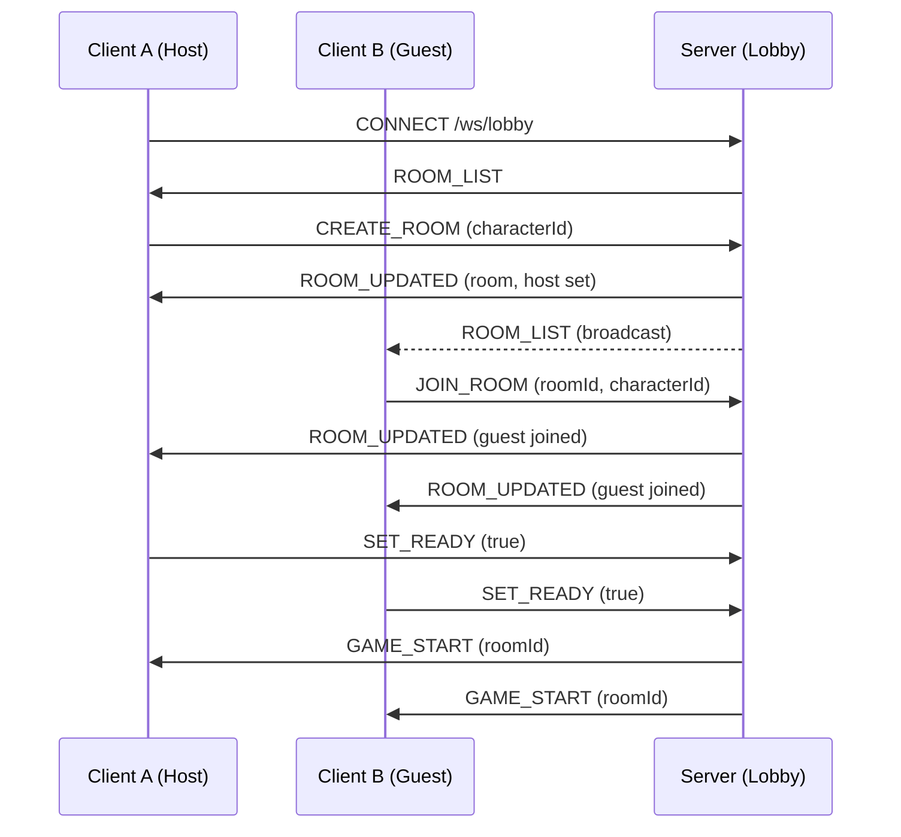
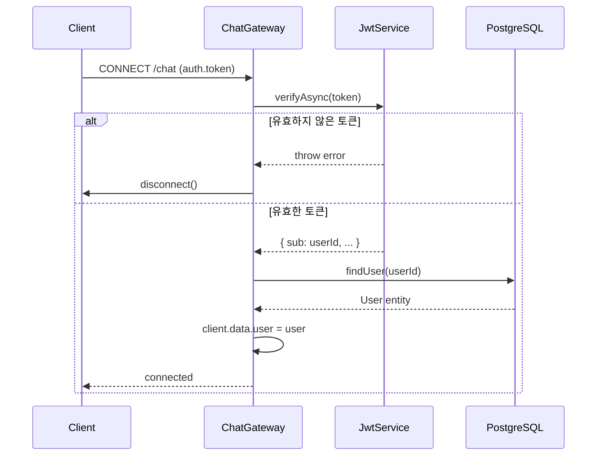
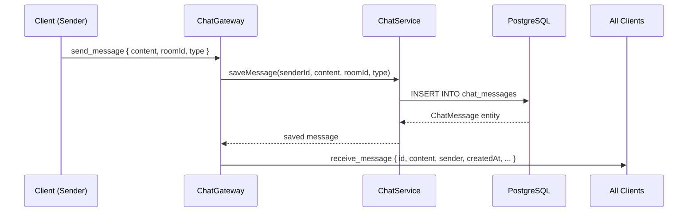
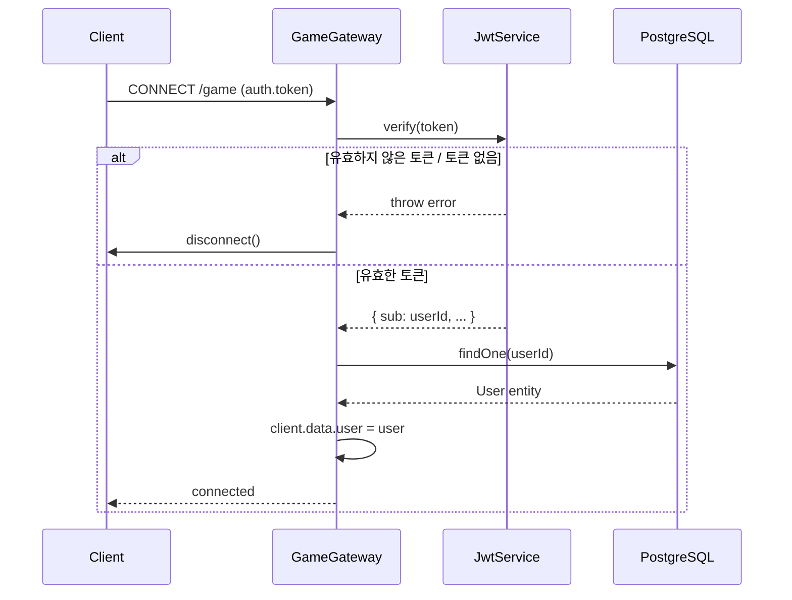
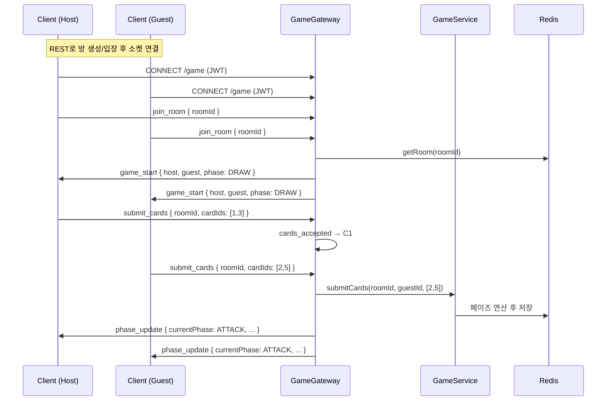

# Game Sync Protocol & WebSocket Sequence (v2)

## 0. Lobby & Room Management Protocol
`/ws/game/{room_id}` 연결 이전, 로비 화면은 별도 엔드포인트 `/ws/lobby`에 연결하여 방 목록과 입장/대기 상태를 동기화함. 메시지 envelope은 [3. Message Envelope Design](#3-message-envelope-design)과 동일한 `{ type, payload, seq }` 구조를 따름. (Backend Epic #2 미구현 상태이며, 이 절은 FE 작업(P3-09)을 위해 선제적으로 정의한 계약임 — 백엔드 구현 시 본 스펙을 기준으로 삼을 것)

방 멤버십(host/guest)은 WebSocket 연결 인스턴스가 아니라 인증된 사용자(JWT)를 기준으로 서버에 보관됨. 따라서 클라이언트가 로비 화면에서 대기실 화면으로 이동하며 소켓을 재연결해도, 서버는 토큰으로 사용자를 식별해 기존 방 소속 상태를 유지하고 `GET_ROOM`에 응답할 수 있어야 함.

### 0.1. Room Object
```json
{
  "id": "room-uuid",
  "host": { "userId": "uuid", "nickname": "host_nick", "characterId": "magician", "ready": false },
  "guest": { "userId": "uuid", "nickname": "guest_nick", "characterId": "knight", "ready": false } | null,
  "status": "WAITING | IN_GAME",
  "createdAt": "2026-06-22T10:00:00Z"
}
```

### 0.2. Client → Server Messages
| Type | Payload | Description |
| :--- | :--- | :--- |
| `LIST_ROOMS` | `{}` | 현재 방 목록 스냅샷 요청 (연결 시 자동 수신도 됨) |
| `CREATE_ROOM` | `{ characterId }` | 새 방 생성, 본인이 host가 됨 |
| `JOIN_ROOM` | `{ roomId, characterId }` | 대기중인 방에 guest로 입장 |
| `GET_ROOM` | `{ roomId }` | 특정 방의 현재 상태 조회. 인증된 사용자가 이미 host/guest로 등록된 방이면 즉시 `ROOM_UPDATED` 응답 (대기실 페이지 진입/재연결 시 사용) |
| `LEAVE_ROOM` | `{ roomId }` | 방 퇴장 (host 퇴장 시 방 폭파) |
| `SET_READY` | `{ roomId, ready }` | 준비 완료/취소 토글 |

### 0.3. Server → Client Messages
| Type | Payload | Description |
| :--- | :--- | :--- |
| `ROOM_LIST` | `{ rooms: Room[] }` | 전체 방 목록 (연결 시 + 변경 발생 시 broadcast) |
| `ROOM_UPDATED` | `{ room: Room }` | 특정 방의 상태 변경 (입장/캐릭터 선택/준비 상태) |
| `ROOM_CLOSED` | `{ roomId }` | 방 삭제 (host 퇴장 등) |
| `GAME_START` | `{ roomId }` | host/guest 모두 ready 시 발송, 클라이언트는 `/ws/game/{roomId}`로 전환 |
| `ACTION_REJECTED` | `{ message }` | 잘못된 요청(예: 이미 가득 찬 방 입장 시도) |

### 0.4. Sequence


## 1. Game Start Sequence
서버와 클라이언트 간의 초기 연결 및 동기화 프로세스입니다.

\`\`\`mermaid
sequenceDiagram
    participant C1 as Client A (Host)
    participant C2 as Client B (Guest)
    participant S as Server (Channels)
    participant R as Redis

    C1->>S: CONNECT /ws/game/{room_id}
    C2->>S: CONNECT /ws/game/{room_id}
    S->>R: CHECK_ROOM_READY
    R-->>S: READY
    S->>C1: MSG: GAME_START (Initial Deck Info)
    S->>C2: MSG: GAME_START (Initial Deck Info)
    S->>C1: MSG: PHASE_UPDATE (DRAW)
    S->>C2: MSG: PHASE_UPDATE (DRAW)
\`\`\`

## 2. In-Game Phase Sync (Move Phase)
이동 페이즈에서의 동기화 예시입니다.

\`\`\`mermaid
sequenceDiagram
    participant C1 as Client A
    participant S as Server
    participant C2 as Client B

    C1->>S: SEND_ACTION (MOVE_CARDS: [4, 7])
    S->>S: VALIDATE_OWNERSHIP & RULES
    Note over S: Client B is still thinking...
    C2->>S: SEND_ACTION (MOVE_CARDS: [2])
    S->>S: COMPUTE_RESULT (Distance, Initiative)
    S->>C1: BROADCAST: MOVE_RESULT (New Dist: 1, Init: A)
    S->>C2: BROADCAST: MOVE_RESULT (New Dist: 1, Init: A)
    S->>C1: BROADCAST: PHASE_UPDATE (ATTACK)
    S->>C2: BROADCAST: PHASE_UPDATE (ATTACK)
\`\`\`

## 3. Message Envelope Design
모든 WebSocket 메시지는 다음 구조를 따름.

\`\`\`json
{
  "type": "ACTION_REJECTED, STATE_UPDATE, NOTIFICATION",
  "payload": { ... },
  "seq": 102  // 클라이언트 측 메시지 순서 보장용 시퀀스 번호
}
\`\`\`

## 4. Reconnection Logic
- **Heartbeat**: 5초마다 PING/PONG 체크.
- **State Recovery**: 재접속 시 서버는 Redis에 보관된 최신 \`room_state\` 전체를 다시 전송함.
- **Grace Period**: 연결 유실 후 15초 내 미복구 시 몰수패 처리.

- **Cluster & Checkpoint-aware Recovery**:
  - 클러스터 환경에서는 Redis 접근 중 `MOVED`/`ASK` 응답이나 일시적 접근 불가가 발생할 수 있으므로 서버는 클러스터-aware 클라이언트로 토폴로지 갱신과 자동 재시도를 수행합니다.
  - 재접속 시 서버가 Redis에서 `room:{id}:state` 키를 찾지 못하거나 접근 오류가 발생하면 다음 순서로 복구를 시도합니다:
    1. 클러스터 클라이언트에서 `MOVED`/`ASK`를 처리하여 재요청(토폴로지 갱신 포함)을 시도합니다.
    2. 재시도 실패 시 PostgreSQL에 저장된 최신 체크포인트(`game_checkpoints` 테이블)를 가져와 세션 상태를 복원합니다.
    3. 체크포인트와 함께 보관된 액션 로그(가능한 경우 Redis Streams 또는 영속 로그)를 재생하여 최신 상태로 보완합니다.
  - 복구 시도는 지수 백오프(예: 초기 100ms, 최대 2s)와 최대 재시도 횟수(예: 5회)를 적용합니다. 모든 시도가 실패하면 서버는 사용자에게 복구 불가 알림을 보내거나 세션을 안전하게 종료합니다.
  - 복구 과정은 메트릭으로 수집합니다: 복구 성공률, 체크포인트 활용률, 재시도 횟수, 복구 지연 등을 모니터링합니다.

---

## 5. Chat Namespace (`/chat`)

### 5.1 연결 인증

Chat WebSocket은 `/chat` namespace에서 동작합니다. 연결 시 반드시 JWT 토큰을 전달해야 합니다.

```json
// 핸드셰이크 auth payload
{
  "auth": {
    "token": "Bearer <JWT_ACCESS_TOKEN>"
  }
}
```

또는 쿼리 파라미터로 전달:

```
/chat?token=Bearer <JWT_ACCESS_TOKEN>
```

토큰이 없거나 유효하지 않으면 서버가 즉시 소켓을 disconnect합니다.

### 5.2 이벤트 정의

#### 클라이언트 → 서버: `send_message`

```json
{
  "content": "안녕하세요!",
  "roomId": "optional-room-id",
  "type": "NORMAL"
}
```

| 필드 | 타입 | 필수 | 설명 |
|------|------|------|------|
| `content` | string | ✓ | 메시지 내용 (비어있을 수 없음) |
| `roomId` | string | - | 특정 채팅방 ID (없으면 글로벌 채널) |
| `type` | `"NORMAL"` \| `"INVITE"` | - | 메시지 유형 (기본값: `"NORMAL"`) |

#### 서버 → 전체 클라이언트: `receive_message`

```json
{
  "id": "uuid-v4",
  "content": "안녕하세요!",
  "roomId": null,
  "type": "NORMAL",
  "createdAt": "2026-06-22T12:00:00.000Z",
  "sender": {
    "id": "user-uuid",
    "nickname": "player1"
  }
}
```

### 5.3 연결 시퀀스



### 5.4 메시지 흐름



### 5.5 REST 보완 API

채팅 히스토리는 WebSocket 외 REST API로도 조회 가능합니다 (JWT 인증 필요).

```
GET /api/chat/history
```

→ 최근 50개 메시지를 `createdAt` 오름차순으로 반환. 상세 스펙은 `API_SPECIFICATION.md` 참조.

---

## 6. Game Namespace (`/game`)

### 6.1 연결 인증

Game WebSocket은 `/game` namespace에서 동작하며, 인증 방식은 `/chat`(5.1)과 동일한 컨벤션을 따릅니다 — 핸드셰이크 `auth.token` 또는 `?token=` 쿼리 파라미터로 `Bearer <JWT_ACCESS_TOKEN>` 전달. 토큰이 없거나 유효하지 않으면 서버가 즉시 소켓을 disconnect합니다.

두 네임스페이스의 공통 토큰 추출 로직은 `src/common/websocket/ws-jwt.util.ts`의 `extractWsToken()`을 공유합니다 (현재 `/game`에서 사용 중이며, `/chat`도 동일 컨벤션이라 추후 이 유틸로 통합 가능).

### 6.2 연결 시퀀스



### 6.3 이벤트 정의 (P4-02~05 구현 완료)

Socket.io 룸 키: `game:{roomId}` (서버 내부 브로드캐스트 채널)

Redis 세션 키: `game:room:{roomId}` (TTL: 7200s / 게임 종료 시 즉시 삭제)

#### 클라이언트 → 서버

| Event | Payload | Description |
|---|---|---|
| `join_room` | `{ roomId: string }` | 소켓 룸 입장. 두 플레이어 모두 입장하면 `game_start` 자동 브로드캐스트 |
| `leave_room` | `{ roomId: string }` | 소켓 룸 퇴장. 상대방에게 `player_left` 발송 |
| `submit_cards` | `{ roomId: string, cardIds: number[] }` | 카드 제출. 양쪽 모두 제출 완료 시 페이즈 연산 후 `phase_update` 브로드캐스트 |

#### 서버 → 클라이언트

| Event | Description |
|---|---|
| `game_start` | 두 플레이어 소켓 룸 입장 완료 시 브로드캐스트 |
| `cards_accepted` | 카드 제출 확인 (제출한 클라이언트에게만) |
| `phase_update` | 페이즈 전환 결과 브로드캐스트 (전체) |
| `player_left` | 상대방 퇴장 알림 |

#### `game_start` payload

```json
{
  "type": "GAME_START",
  "payload": {
    "roomId": "uuid",
    "host": { "userId": "uuid", "nickname": "...", "characterId": 1, "hp": 20, "cardsInHand": [1, 5, 12, 33, 7] },
    "guest": { "userId": "uuid", "nickname": "...", "characterId": 2, "hp": 20, "cardsInHand": [3, 9, 14, 20, 28] },
    "phase": "DRAW",
    "distance": 3,
    "currentTurn": 1
  },
  "seq": 0
}
```

#### `phase_update` payload

페이즈 전환 및 게임 상태 전체 업데이트.

```json
{
  "type": "PHASE_UPDATE",
  "payload": {
    "roomId": "uuid",
    "status": "IN_GAME",
    "currentPhase": "ATTACK",
    "initiative": "host",
    "distance": 3,
    "currentTurn": 2,
    "hostHp": 15,
    "guestHp": 18,
    "hostCardsInHand": [5, 12, 33],
    "guestCardsInHand": [9, 20, 28],
    "statusEffects": {
      "host": [],
      "guest": [{ "type": "POISON", "duration": 2 }]
    },
    "diceResults": {
      "hostAtk": { "count": 3, "successes": 2, "details": [true, true, false] },
      "guestDef": { "count": 2, "successes": 1, "details": [true, false] }
    },
    "skillsTriggered": ["[SKILL] host의 Shadowstep 발동!"],
    "winnerId": null
  },
  "seq": 0
}
```

**`phase_update` 필드 설명:**
- `currentPhase`: 게임 종료 시 `null`
- `winnerId`: 게임 종료 시 승자 userId, 게임 중에는 `null`
- `diceResults`: 주사위가 굴려진 페이즈(DEFENSE, RESULT)에서만 값 존재
- `skillsTriggered`: 트리거된 스킬 로그 문자열 배열

#### `cards_accepted` payload

```json
{
  "type": "CARDS_ACCEPTED",
  "payload": { "roomId": "uuid" },
  "seq": 0
}
```

#### `player_left` payload

```json
{
  "type": "PLAYER_LEFT",
  "payload": { "userId": "uuid", "nickname": "..." },
  "seq": 0
}
```

#### 게임 흐름 시퀀스



### 6.4 전적 통계 & 리더보드 REST API (P3-08)

게임 종료 시 `MatchHistory`에 기록되며, 아래 REST API로 조회합니다.

| Method | Path | Description |
|---|---|---|
| `GET` | `/api/game/users/:id/stats` | 전적 통계 (wins, losses, winRate, totalGames) |
| `GET` | `/api/game/users/:id/matches` | 매치 히스토리 목록 (query: `page`, `limit`) |
| `GET` | `/api/game/leaderboard` | 승률 기준 상위 10명 |

**stats 응답 예시:**
```json
{ "data": { "wins": 5, "losses": 3, "totalGames": 8, "winRate": 0.63 } }
```

**leaderboard 응답 예시:**
```json
{
  "data": [
    { "id": "uuid", "nickname": "player1", "wins": 10, "losses": 2, "totalGames": 12, "winRate": 0.83 }
  ]
}
```

### 6.5 알려진 미구현 항목

| 항목 | 현재 상태 | 필요 |
|---|---|---|
| `TIMER_UPDATE` 이벤트 | 없음 | 서버 30초 타이머 push |
| 단건 방 GET API | 없음 | 재연결 시 상태 복구용 |
| 카드 메타데이터 API | 없음 | 카드 타입/값 표시 |
| `RECONNECT_STATE` 이벤트 | 없음 | 재연결 후 최신 상태 복구 |

### 6.6 프론트엔드 구현 파일

| 파일 | 역할 |
|---|---|
| `src/types/game.ts` | RoomStatus, GamePhase, CardType, StatusEffect 타입 |
| `src/types/gameSocket.ts` | 이벤트 페이로드 타입 + Server/ClientToServerEvents 맵 |
| `src/context/GameSocketContext.tsx` | 소켓 연결 상태 관리, Provider |
| `src/hooks/useGameSocket.ts` | roomId별 join/leave + 이벤트 핸들러 구독 |
| `src/pages/GameBoardPage.tsx` | 게임 보드 페이지, `/game/:roomId` |
| `src/components/game/CardItem.tsx` | 카드 컴포넌트 (선택/타입 표시) |
| `src/components/game/HandArea.tsx` | 카드 핸드 + Submit 버튼 영역 |
